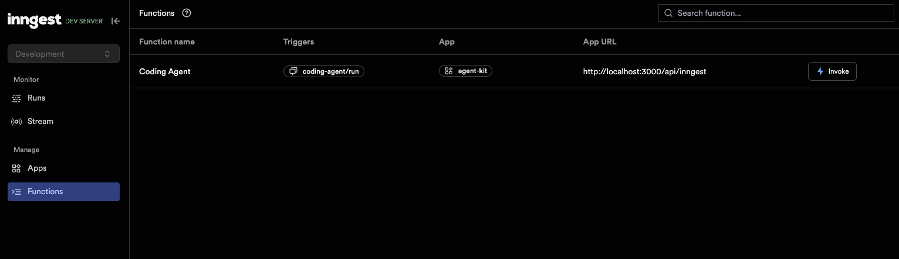
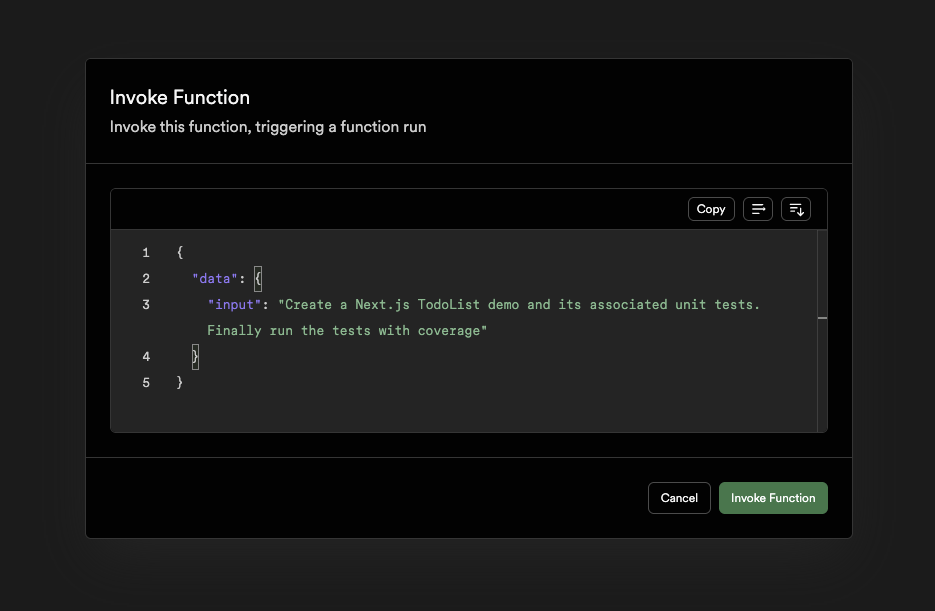
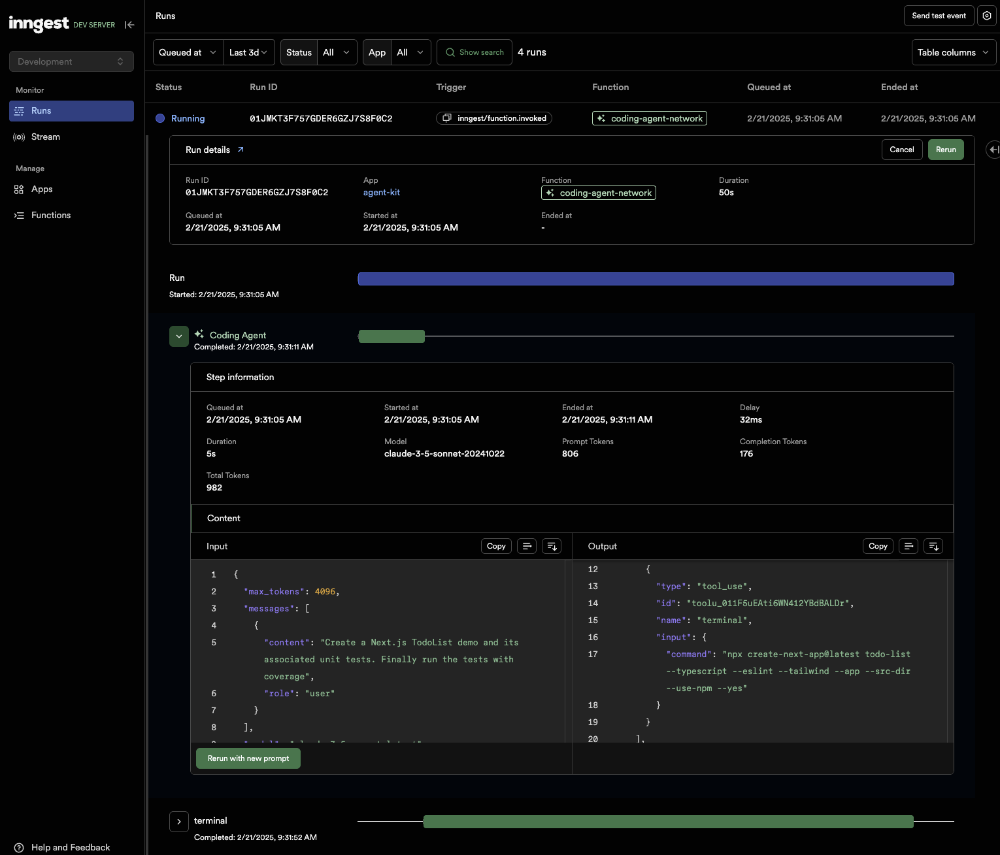

# AgentKit Coding Agent with E2B Code Interpreter

This example demonstrates how to build an AI coding agent using AgentKit and E2B Code Interpreter. The agent can execute code and help with programming tasks.

https://github.com/user-attachments/assets/4aaf784a-f6da-4327-b3f6-01573b57f1a0

## Setup

1. Install dependencies:

```bash
npm install
```

2. Create a `.env` file in the root of the project with the following environment variables:

```bash
E2B_API_KEY=your_e2b_api_key # Get one at https://e2b.dev/docs
ANTHROPIC_API_KEY=your_anthropic_api_key # Get one at https://console.anthropic.com/settings/keys
```

3. Start the program:

```bash
npm run start
```

4. Start the Inngest Dev Server:

```bash
npx inngest-cli@latest dev
```

5. Open the Inngest Dev Server at [http://127.0.0.1:8288/functions](http://127.0.0.1:8288/functions)



6. Trigger the Coding Agent with the following input:

```json
{
  "data": {
    "input": "Create a Next.js TodoList demo and its associated unit tests. Finally run the tests with coverage"
  }
}
```



7. The agent will start executing the task and you will see the output in the Inngest Dev Server.



## Features

- Code execution using E2B Code Interpreter
- Built with AgentKit for robust agent capabilities
- TypeScript support
- Hot reloading during development
- Durable execution (retries on rate limits, etc) with Inngest

## Project Structure

The project uses TypeScript and is set up with the following key dependencies:

- `@e2b/code-interpreter`: For code execution capabilities
- `@inngest/agent-kit`: For building the AI agent
- `zod`: For runtime type checking
- `typescript`: For static type checking
