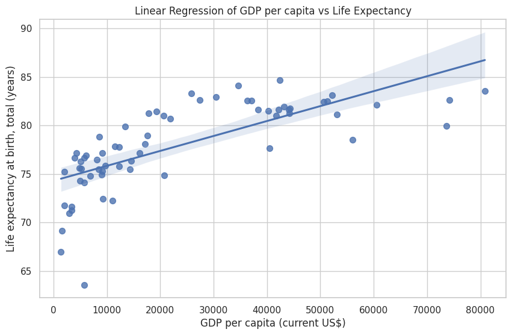

# AI Code Execution with AI/ML API and E2B

This example demonstrates how to run LLM-generated Python code using the [AI/ML API](https://aimlapi.com/app/?utm_source=e2b&utm_medium=github&utm_campaign=integration) and [E2B Code Interpreter SDK](https://e2b.dev).

The AI performs a data analysis task on an uploaded CSV file, generates Python code with an AI/ML API model, and executes the code inside a sandboxed environment using E2B.

---

## 🔧 Setup

### 1. Install dependencies

```bash
npm install
````

### 2. Setup environment

Create `.env` file:

```bash
cp .env.template .env
```

Then set your:

* `AIML_API_KEY`: Get it at [https://aimlapi.com/app/](https://aimlapi.com/app/?utm_source=e2b&utm_medium=github&utm_campaign=integration)
* `E2B_API_KEY`: Get it at https://e2b.dev/docs/getting-started/api-key

### 3. Run

```bash
npm run start
```

You will see:

* The dataset gets uploaded
* Prompt sent to the model
* Code generated and executed in the cloud
* A result saved as `image_1.png`



---

## 🤖 Models

This uses any OpenAI-compatible model available on AI/ML API, such as:

* `gpt-3.5-turbo`
* `deepseek-coder`
* `gemini-pro`
* and [many more](https://aimlapi.com/models/?utm_source=e2b&utm_medium=github&utm_campaign=integration)

---

## 🧠 Learn more

* [AI/ML API Documentation](https://docs.aimlapi.com/?utm_source=e2b&utm_medium=github&utm_campaign=integration)
* [E2B Code Interpreter Docs](https://e2b.dev/docs)
