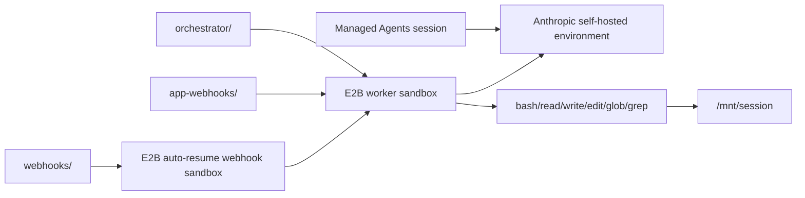

# Claude Managed Agents with E2B Workers for JavaScript

Run [Anthropic Managed Agents](https://platform.claude.com/docs/en/managed-agents/overview)
self-hosted environment workers from E2B sandboxes with TypeScript.

This directory contains the shared TypeScript modules and three runnable use-case folders:

| Folder | Use case |
| --- | --- |
| [`orchestrator/`](./orchestrator/) | Your app or CLI starts and manages a long-running E2B worker sandbox. |
| [`webhooks/`](./webhooks/) | Anthropic webhooks wake an auto-resumable E2B sandbox, which starts the worker on demand. |
| [`app-webhooks/`](./app-webhooks/) | Your app receives Anthropic webhooks, then starts or reconnects the E2B worker sandbox. |

The implementation lives in [`src/`](./src/). The E2B template bakes in Node.js, the
Anthropic SDK, `tsx`, shell tools, and a writable `/mnt/session` workdir.



## Shared Setup

From this directory:

```bash
npm install
cp .env.template .env
```

Fill in `.env`. The example also reads the repository root `.env` if you keep shared keys there.

| Variable | Notes |
| --- | --- |
| `E2B_API_KEY` | Required to start worker sandboxes. |
| `E2B_ACCESS_TOKEN` | Required to build the E2B template. |
| `ANTHROPIC_API_KEY` | Used by setup scripts and the session smoke driver. |
| `ANTHROPIC_ENVIRONMENT_ID` | Printed by `npm run create-environment`. |
| `ANTHROPIC_ENVIRONMENT_KEY` | Generate this from the [Anthropic Environments workspace](https://platform.claude.com/workspaces/default/environments). See Anthropic's [environment docs](https://platform.claude.com/docs/en/managed-agents/environments). |
| `ANTHROPIC_WEBHOOK_SIGNING_KEY` | Required only for receiving webhook deliveries. See [`webhooks/`](./webhooks/). |
| `ANTHROPIC_AGENT_ID` | Printed by `npm run create-agent`. |

When a worker sandbox starts, the example writes the sandbox ID back to the Anthropic
environment metadata. Use `npm run show-environment` to inspect:

| Metadata key | Set by |
| --- | --- |
| `e2b_worker_sandbox_id` | Last worker sandbox, kept for compatibility. |
| `e2b_worker_sandbox_ids` | JSON list of known worker sandboxes. |
| `e2b_webhook_sandbox_id` | Last webhook sandbox, kept for compatibility. |
| `e2b_webhook_sandbox_ids` | JSON list of known webhook sandboxes. |

The [`app-webhooks/`](./app-webhooks/) flow also keeps an app-owned
session-to-sandbox store so multiple Managed Agents sessions can map to different E2B sandboxes.

## Validation

```bash
npm run check
```

For a concrete event-by-event walkthrough, see [EXAMPLE_USAGE.md](./EXAMPLE_USAGE.md).
For the functions to implement when porting this pattern, see [IMPLEMENTATION.md](./IMPLEMENTATION.md).
