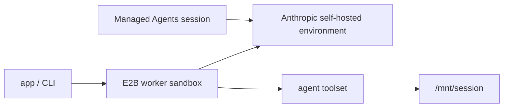

# JavaScript Orchestrator Worker

Use this flow when your app or CLI owns worker lifecycle. It starts one E2B sandbox that
polls Anthropic for self-hosted environment work and serves Managed Agents sessions.

For the Anthropic concepts behind these commands, see the Managed Agents docs for
[agents](https://platform.claude.com/docs/en/managed-agents/agents),
[environments](https://platform.claude.com/docs/en/managed-agents/environments), and
[sessions](https://platform.claude.com/docs/en/managed-agents/sessions).



## Setup

From the parent `javascript/` directory:

```bash
npm install
cp .env.template .env
```

Fill in `../.env`:

| Variable | Notes |
| --- | --- |
| `E2B_API_KEY` | Required to start worker sandboxes. |
| `E2B_ACCESS_TOKEN` | Required to build the E2B template. |
| `ANTHROPIC_API_KEY` | Used to create environments, agents, and sessions. |
| `ANTHROPIC_ENVIRONMENT_ID` | Printed by `create-environment`. |
| `ANTHROPIC_ENVIRONMENT_KEY` | Generated from the [Anthropic Environments workspace](https://platform.claude.com/workspaces/default/environments). See Anthropic's [environment docs](https://platform.claude.com/docs/en/managed-agents/environments). |
| `ANTHROPIC_AGENT_ID` | Printed by `create-agent`. |

## Create Anthropic Resources

```bash
make create-environment NAME=my-e2b-js-env
```

Save the printed `ANTHROPIC_ENVIRONMENT_ID`, open the printed URL in the
[Anthropic Environments workspace](https://platform.claude.com/workspaces/default/environments), and generate
`ANTHROPIC_ENVIRONMENT_KEY` for the self-hosted environment.

```bash
make create-agent NAME=my-e2b-js-agent
```

Save the printed `ANTHROPIC_AGENT_ID`.

## Build the E2B Template

```bash
make build-template
```

This bakes Node.js, the Anthropic SDK, `tsx`, shell tools, and the worker/webhook runtime into
the E2B template.

## Run

```bash
make start-worker
make send
```

To stop the sandbox:

```bash
make stop-worker SANDBOX_ID=<E2B_WORKER_SANDBOX_ID>
```

The worker uses `/mnt/session` as this example's E2B workdir and writes generated artifacts
under `/mnt/session/outputs` when useful.

For a concrete event-by-event walkthrough, see [../EXAMPLE_USAGE.md](../EXAMPLE_USAGE.md).
