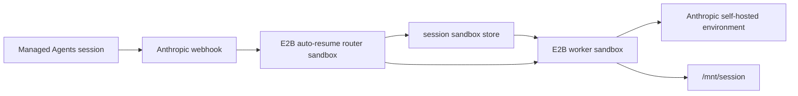

# JavaScript Auto-Resume Webhook Worker

Use this flow when you want Anthropic to wake an E2B-hosted router on demand. The router runs inside
an auto-resumable E2B sandbox and starts or reconnects a worker sandbox for each session.

When a Managed Agents session needs work, Anthropic sends a `session.status_run_started`
webhook, E2B auto-resumes the router sandbox, and the router claims work from Anthropic's
self-hosted environment queue. The claimed session id becomes the default E2B worker sandbox key.



## Setup

Install dependencies and create `.env` from the parent `javascript/` directory:

```bash
npm install
cp .env.template .env
```

Then run the `make ...` commands below from this `webhooks/` directory.

Fill in `.env`:

| Variable | Notes |
| --- | --- |
| `E2B_API_KEY` | Required to start the router sandbox and session worker sandboxes. |
| `E2B_ACCESS_TOKEN` | Required to build the E2B template. |
| `ANTHROPIC_API_KEY` | Used by the webhook router to claim work and inspect sessions. |
| `ANTHROPIC_ENVIRONMENT_ID` | Anthropic self-hosted environment id. |
| `ANTHROPIC_ENVIRONMENT_KEY` | Anthropic self-hosted environment key from the [Anthropic Environments workspace](https://platform.claude.com/workspaces/default/environments). |
| `ANTHROPIC_WEBHOOK_SIGNING_KEY` | Required for real webhook deliveries. Start once without it to get the URL, then add it. |

## Build the E2B Template

```bash
make build-template
```

The reusable public template name for this flow is `E2B/claude-managed-agents-webhooks`. See
[PUBLIC_TEMPLATE.md](./PUBLIC_TEMPLATE.md) for the minimal SDK usage shape and a complete
setup-and-smoke-test process for using the webhook receiver as the worker sandbox.

## Start Once to Get the Webhook URL

You can start the webhook sandbox before creating the Anthropic webhook endpoint:

```bash
make start-webhook-server
```

The command prints:

```bash
E2B_WEBHOOK_SANDBOX_ID=...
Anthropic webhook URL: https://.../webhook
```

The command stores `E2B_WEBHOOK_SANDBOX_ID` on the Anthropic environment metadata as
`e2b_webhook_sandbox_id`. That gives another process a lookup path from
`ANTHROPIC_ENVIRONMENT_ID` to the auto-resumable E2B webhook sandbox:

```bash
make show-environment
```

Create an Anthropic webhook endpoint in the [Anthropic Agents workspace](https://platform.claude.com/workspaces/default/agents) with the printed URL and subscribe it to
`session.status_run_started`. For signing details, see Anthropic's
[Managed Agents webhook docs](https://platform.claude.com/docs/en/managed-agents/webhooks).

Save the generated signing key as `ANTHROPIC_WEBHOOK_SIGNING_KEY` in `../.env`, then run the
command again with the same sandbox ID. The helper writes the signing key into the sandbox so the
public URL stays unchanged:

```bash
make start-webhook-server SANDBOX_ID=<E2B_WEBHOOK_SANDBOX_ID>
```

Until the key is configured, `/webhook` returns `503`.

## Stop

```bash
make stop-worker SANDBOX_ID=<E2B_WEBHOOK_SANDBOX_ID>
```

If the stopped sandbox ID matches `e2b_webhook_sandbox_id`, the stop command clears that metadata key.

## Notes

- The webhook router sandbox uses `lifecycle: { onTimeout: "pause", autoResume: true }`.
- The webhook router is only the event-driven entrypoint. It drains Anthropic's self-hosted
  environment queue, claims work, and routes each claimed session to an E2B worker sandbox.
- The public template defaults to `APP_SANDBOX_ROUTING_SCOPE=session`, so follow-up turns for the
  same Managed Agents session reconnect to the same worker sandbox and `/mnt/session` filesystem.
- Use `APP_SANDBOX_ROUTING_SCOPE=agent` or `environment` only when you intentionally want broader
  sandbox reuse.

For a concrete event-by-event walkthrough, see [../EXAMPLE_USAGE.md](../EXAMPLE_USAGE.md).
For a complete code-level implementation, see [IMPLEMENTATION.md](./IMPLEMENTATION.md).
