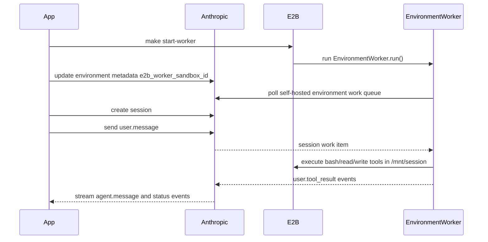
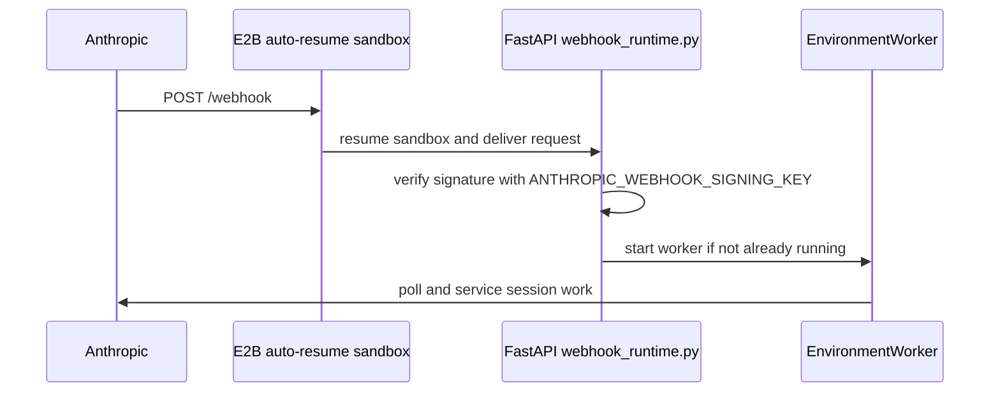

# Example Usage Walkthrough

This page shows what the examples expect Anthropic to send and how the E2B worker responds.

## Orchestrator Flow

In the orchestrator example, your app starts the worker before sending user messages.



### What Your App Sends

`make send` creates a Managed Agents session and sends one user event:

```python
session = client.beta.sessions.create(
    agent=os.environ["ANTHROPIC_AGENT_ID"],
    environment_id=os.environ["ANTHROPIC_ENVIRONMENT_ID"],
)

client.beta.sessions.events.send(
    session.id,
    events=[
        {
            "type": "user.message",
            "content": [{"type": "text", "text": "Run pwd, then echo hello from E2B"}],
        }
    ],
)
```

### What Anthropic Streams Back

The exact IDs and timestamps differ, but a successful run has this shape:

```text
session=sesn_...
SessionStatusRunningEvent(type='session.status_running')
UserMessageEvent(type='user.message', content=[TextBlock(text='Run pwd, then echo hello from E2B')])
AgentToolUseEvent(type='agent.tool_use', name='bash', input={'command': 'pwd'})
SessionStatusIdleEvent(stop_reason=RequiresAction(...))
UserToolResultEvent(type='user.tool_result', content=[TextBlock(text='/mnt/session')])
SessionStatusRunningEvent(type='session.status_running')
AgentToolUseEvent(type='agent.tool_use', name='bash', input={'command': 'echo hello from E2B'})
UserToolResultEvent(type='user.tool_result', content=[TextBlock(text='hello from E2B')])
AgentMessageEvent(type='agent.message', content=[TextBlock(text='...')])
SessionStatusIdleEvent(stop_reason=EndTurn(...))
```

The `agent.tool_use` events come from Anthropic. The SDK worker running inside E2B executes those
tool calls and sends matching `user.tool_result` events back to Anthropic.

## Webhook Flow

In the webhook example, Anthropic wakes the E2B sandbox when a session needs work.



### What Anthropic Sends to `/webhook`

Anthropic signs the raw body and sends Standard Webhooks-style headers. The receiver passes the
raw body and headers to `client.beta.webhooks.unwrap(...)`.

Representative request:

```http
POST /webhook HTTP/1.1
content-type: application/json
webhook-id: whmsg_...
webhook-timestamp: 1760000000
webhook-signature: v1,...
```

Representative body:

```json
{
  "id": "event_...",
  "type": "event",
  "created_at": "2026-05-20T09:44:28.000000Z",
  "data": {
    "type": "session.status_run_started",
    "id": "sesn_...",
    "workspace_id": "wrkspc_...",
    "organization_id": "org_..."
  }
}
```

The Python webhook handler only uses the event type:

```python
event = client.beta.webhooks.unwrap(payload, headers=dict(request.headers), key=signing_key)

if event.data.type == "session.status_run_started":
    start_worker_if_needed()
```

If `ANTHROPIC_WEBHOOK_SIGNING_KEY` is missing, `/webhook` returns `503` so you can start the
sandbox once to get its public URL before creating the Anthropic webhook endpoint.

## Worker Contract

Both flows use the same worker contract:

| Value | Meaning |
| --- | --- |
| `ANTHROPIC_ENVIRONMENT_ID` | The self-hosted environment the worker polls. |
| `ANTHROPIC_ENVIRONMENT_KEY` | Bearer credential for the environment worker. |
| `/mnt/session` | This example's E2B workdir. |
| `/mnt/session/outputs` | Suggested artifact output directory. |
| `e2b_worker_sandbox_id` | Environment metadata key for the orchestrator worker sandbox. |
| `e2b_webhook_sandbox_id` | Environment metadata key for the auto-resumable webhook sandbox. |

The worker is intentionally simple: one E2B sandbox can service sessions for the environment, but it
is not production per-session isolation.
