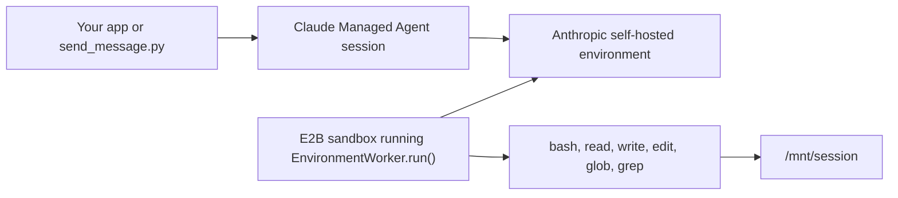

# Claude Managed Agents with E2B Workers

Run an Anthropic Managed Agents self-hosted environment from an E2B sandbox.

This version follows Anthropic's self-hosted worker model directly: E2B starts a Linux sandbox, uploads a small `worker.py`, and that process calls Anthropic's SDK `EnvironmentWorker.run()`. The SDK owns the managed-agent work loop: polling, claiming, heartbeats, tool execution, and returning results to the Claude session.



## What E2B Adds

| Piece | Role |
| --- | --- |
| E2B template | Python 3.12 image with shell utilities and the Anthropic SDK installed. |
| E2B worker sandbox | Long-running runtime for Anthropic's environment worker. |
| `worker.py` | Minimal wrapper around `client.beta.environments.work.worker(...).run()`. |
| `send_message.py` | Small smoke driver that creates a session and streams events. |

## Setup

```bash
python3.12 -m venv .venv
source .venv/bin/activate
pip install -e .

cp .env.template .env
```

Fill in `.env`. The example also reads the repository root `.env` if you keep shared keys there.

| Variable | Notes |
| --- | --- |
| `E2B_API_KEY` | Required to start worker sandboxes. |
| `E2B_ACCESS_TOKEN` | Required to build the E2B template. |
| `ANTHROPIC_API_KEY` | Used by setup scripts and the session smoke driver. |
| `ANTHROPIC_ENVIRONMENT_ID` | Printed by `create_environment.py`. |
| `ANTHROPIC_ENVIRONMENT_KEY` | Generate this in the Claude Console environment page. |
| `ANTHROPIC_AGENT_ID` | Printed by `create_agent.py`. |
| `E2B_TEMPLATE_NAME` | Defaults to `anthropic-managed-agents`. |
| `E2B_WORKER_SANDBOX_ID` | Optional saved worker sandbox id for `stop_worker.py`. |

## Create Anthropic Resources

Create a self-hosted environment:

```bash
python create_environment.py my-e2b-env
```

Save the printed `ANTHROPIC_ENVIRONMENT_ID`, then open the printed Claude Console URL and generate `ANTHROPIC_ENVIRONMENT_KEY`.

Create a test agent:

```bash
python create_agent.py my-e2b-agent
```

Save the printed `ANTHROPIC_AGENT_ID`.

## Build the E2B Template

```bash
python build_template.py
```

This builds an E2B template with Python, shell tools, the Anthropic SDK, and a writable `/mnt/session` workdir.

## Start the Worker

```bash
python start_worker.py
```

Save the printed `E2B_WORKER_SANDBOX_ID` if you want to stop it later with:

```bash
python stop_worker.py "$E2B_WORKER_SANDBOX_ID"
```

The worker sandbox runs:

```python
await client.beta.environments.work.worker(
    environment_id=environment_id,
    environment_key=environment_key,
    workdir="/mnt/session",
    unrestricted_paths=True,
    max_idle=300,
).run()
```

## Drive a Session

With the worker running, send a message:

```bash
python send_message.py "Run pwd, then echo hello from E2B"
```

Expected event stream signals:

```text
UserToolResultEvent ... text='/mnt/session'
UserToolResultEvent ... text='hello from E2B'
SessionStatusIdleEvent ... stop_reason=EndTurn
```

## Notes

- This example intentionally keeps the host side small and lets Anthropic's SDK manage the work queue.
- One worker sandbox can service the self-hosted environment. Start more workers if you want more capacity.
- Tool calls execute inside the E2B sandbox under `/mnt/session`.
- For production, use separate credentials for setup/session creation and for the self-hosted worker.

