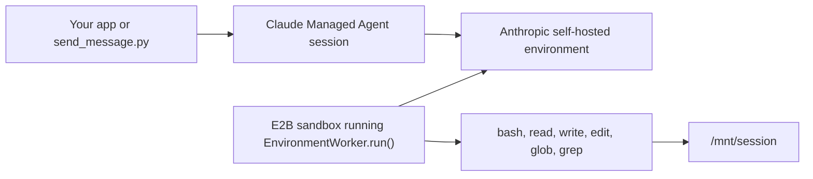

# Claude Managed Agents with E2B Workers

Run an Anthropic Managed Agents self-hosted environment from an E2B sandbox.

This version follows Anthropic's self-hosted worker model directly: E2B starts a Linux sandbox, uploads a small `worker.py`, and that process calls Anthropic's SDK `EnvironmentWorker.run()`. The SDK owns the managed-agent work loop: polling, claiming, heartbeats, tool execution, and returning results to the Claude session.



## What E2B Adds

| Piece | Role |
| --- | --- |
| E2B template | Python 3.12 image with shell utilities and the Anthropic SDK installed. |
| E2B worker sandbox | Long-running runtime for Anthropic's environment worker. |
| `anthropic_managed_agents_e2b/` | Importable Python package for setup, E2B lifecycle, and smoke-session helpers. |
| `worker.py` | Compatibility wrapper around the packaged worker runtime uploaded into E2B. |
| `send_message.py` | Compatibility wrapper for a smoke driver that creates a session and streams events. |

For a function-by-function walkthrough, see [INTERNALS.md](./INTERNALS.md).

## Setup

```bash
python3.12 -m venv .venv
source .venv/bin/activate
pip install -e .

cp .env.template .env
```

Fill in `.env`. The example also reads the repository root `.env` if you keep shared keys there.

| Variable | Notes |
| --- | --- |
| `E2B_API_KEY` | Required to start worker sandboxes. |
| `E2B_ACCESS_TOKEN` | Required to build the E2B template. |
| `ANTHROPIC_API_KEY` | Used by setup scripts and the session smoke driver. |
| `ANTHROPIC_ENVIRONMENT_ID` | Printed by `create_environment.py`. |
| `ANTHROPIC_ENVIRONMENT_KEY` | Generate this in the Claude Console environment page. |
| `ANTHROPIC_WEBHOOK_SIGNING_KEY` | Required only for the webhook server flow. Generate this when creating the webhook endpoint. |
| `ANTHROPIC_AGENT_ID` | Printed by `create_agent.py`. |

## Create Anthropic Resources

Create a self-hosted environment:

```bash
python create_environment.py my-e2b-env
```

After installing the package, the same command is available as:

```bash
anthropic-managed-agents-create-environment my-e2b-env
```

Save the printed `ANTHROPIC_ENVIRONMENT_ID`, then open the printed Claude Console URL and generate `ANTHROPIC_ENVIRONMENT_KEY`.

Create a test agent:

```bash
python create_agent.py my-e2b-agent
```

Or:

```bash
anthropic-managed-agents-create-agent my-e2b-agent
```

Save the printed `ANTHROPIC_AGENT_ID`.

## Build the E2B Template

```bash
python build_template.py
```

Or:

```bash
anthropic-managed-agents-build-template
```

This builds an E2B template with Python, shell tools, the Anthropic/FastAPI runtime dependencies,
the packaged worker code, and a writable `/mnt/session` workdir.

The default template name is `anthropic-managed-agents`. Use `--template-name` to override it.

## Start the Worker

```bash
python start_worker.py
```

Or:

```bash
anthropic-managed-agents-start-worker
```

Save the printed `E2B_WORKER_SANDBOX_ID` if you want to stop it later with:

```bash
python stop_worker.py "<sandbox-id>"
```

Or with Make:

```bash
make stop-worker SANDBOX_ID="<sandbox-id>"
```

Or:

```bash
anthropic-managed-agents-stop-worker "<sandbox-id>"
```

Worker runtime defaults are intentionally CLI options, not `.env` entries:

```bash
python start_worker.py --timeout 3600 --max-idle 300 --log-level INFO
```

The worker sandbox runs:

```python
await client.beta.environments.work.worker(
    environment_id=environment_id,
    environment_key=environment_key,
    workdir="/mnt/session",
    unrestricted_paths=True,
    max_idle=300,
).run()
```

## Webhook Server with Auto-Resume

The direct worker flow is easiest for local smoke tests. For a more production-like shape, run the
webhook receiver inside an E2B sandbox with auto-resume enabled:

```bash
python start_webhook_server.py
```

Or:

```bash
anthropic-managed-agents-start-webhook-server
```

This creates an E2B sandbox with:

```python
lifecycle={"on_timeout": "pause", "auto_resume": True}
```

It starts a FastAPI server at `/webhook` and prints a public HTTPS URL. In the Anthropic Console,
create a webhook endpoint with that URL and subscribe it to `session.status_run_started`. Copy the
generated `whsec_...` signing key into `ANTHROPIC_WEBHOOK_SIGNING_KEY`, then restart the webhook
server so it can verify deliveries.

When Anthropic delivers `session.status_run_started`, E2B auto-resumes the sandbox if it was paused.
The webhook handler verifies the signature, starts `EnvironmentWorker.run()` if it is not already
running, and returns `204`.

Stop the webhook sandbox with the same stop command:

```bash
python stop_worker.py "<sandbox-id>"
```

## Drive a Session

With the worker running, send a message:

```bash
python send_message.py "Run pwd, then echo hello from E2B"
```

Or:

```bash
anthropic-managed-agents-send-message "Run pwd, then echo hello from E2B"
```

Expected event stream signals:

```text
UserToolResultEvent ... text='/mnt/session'
UserToolResultEvent ... text='hello from E2B'
SessionStatusIdleEvent ... stop_reason=EndTurn
```

## Notes

- This example intentionally keeps the host side small and lets Anthropic's SDK manage the work queue.
- The template bakes in the package and dependencies. Secrets stay runtime-only and are passed when the worker or webhook server starts.
- One worker sandbox can service the self-hosted environment. Start more workers if you want more capacity.
- The webhook server flow is for event-driven starts. It still runs the same Anthropic environment worker inside E2B.
- Tool calls execute inside the E2B sandbox under `/mnt/session`.
- For production, use separate credentials for setup/session creation and for the self-hosted worker.

## Validation

```bash
make check
uv run ruff check .
uv build --wheel
```

The live smoke path requires Anthropic and E2B credentials: build the template, start the worker, send a message, then stop the worker.
