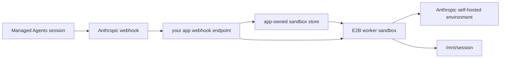

# Python App-Owned Webhook Worker

Use this flow when your application should receive Anthropic webhooks and decide which E2B
sandbox should handle the work. Anthropic calls your app, your app verifies the webhook, then your
app starts or reconnects the E2B worker sandbox.



## Setup

From the parent `python/` directory:

```bash
uv sync
cp .env.template .env
```

Fill in `.env`:

| Variable | Notes |
| --- | --- |
| `E2B_API_KEY` | Required to start worker sandboxes. |
| `E2B_ACCESS_TOKEN` | Required to build the E2B template. |
| `ANTHROPIC_API_KEY` | Used to verify webhooks, read environment metadata, and update sandbox metadata. |
| `ANTHROPIC_ENVIRONMENT_ID` | Anthropic self-hosted environment id. |
| `ANTHROPIC_ENVIRONMENT_KEY` | Anthropic self-hosted environment key from the [Anthropic Environments workspace](https://platform.claude.com/workspaces/default/environments). |
| `ANTHROPIC_WEBHOOK_SIGNING_KEY` | Required for real webhook deliveries. |
| `APP_WEBHOOK_ADMIN_TOKEN` | Bearer token for app-owned debug endpoints such as `GET /sandboxes`. |
| `APP_SANDBOX_STORE_PATH` | Optional path for the app-owned session-to-sandbox JSON store. Defaults to `../.managed-agent-sandbox-store.json`. |
| `APP_SANDBOX_ROUTING_SCOPE` | Optional sandbox reuse scope: `session` (default), `agent`, or `environment`. |

## Build the E2B Template

```bash
make build-template
```

## Run the App Webhook Server

Expose this app endpoint from your own deployment or a tunnel while testing:

```bash
make start-app-webhook-server
```

Register `https://<your-app-host>/webhook` in the
[Anthropic Agents workspace](https://platform.claude.com/workspaces/default/agents) and subscribe it
to `session.status_run_started`.

When Anthropic sends a run-started webhook, the app:

1. Verifies the raw payload with `ANTHROPIC_WEBHOOK_SIGNING_KEY`.
2. Wakes an app-side drain of Anthropic's self-hosted environment work queue.
3. Claims queued work with the environment key.
4. Computes the sandbox routing key from the claimed work item's session id and
   `APP_SANDBOX_ROUTING_SCOPE`.
5. Reconnects to that route's sandbox or creates a fresh E2B sandbox, writes the store assignment,
   and starts the worker with the claimed `ANTHROPIC_WORK_ID` and `ANTHROPIC_SESSION_ID`.

Routing scopes:

| Scope | Sandbox key | Use when |
| --- | --- | --- |
| `session` | `environment_id + session_id` | You want the strongest isolation and separate filesystem state per Managed Agents session. |
| `agent` | `environment_id + agent.id` | You want sessions for the same agent to reuse a warm sandbox. The app retrieves the session to read `agent.id`. |
| `environment` | `environment_id` | You want one shared worker sandbox for the whole self-hosted environment. |

The JSON store is a local example store. For a multi-instance app, use a database with a
transactional session assignment so duplicate webhook deliveries cannot create duplicate workers.
SQLite is enough for a single-node deployment; Postgres or Redis is a better fit once multiple app
replicas can receive the same webhook. An in-memory catalog is only useful for a toy demo because a
process restart loses the session-to-sandbox mapping needed for follow-up work.

Worker sandboxes are created with E2B auto-resume and pause-on-timeout lifecycle settings. The app
does not need to manually pause them: the app claims work, the sandbox handles that claimed item,
the worker exits after idle, and E2B pauses the sandbox after its timeout. A follow-up event for the
same session reconnects to the same sandbox.

The app drains the environment queue because the queue, not the webhook payload, is the source of
truth for which work item has been claimed. That prevents a session-owned sandbox from accidentally
polling and claiming a different queued session.

Inspect the app-owned assignments:

```bash
curl -H "Authorization: Bearer $APP_WEBHOOK_ADMIN_TOKEN" http://127.0.0.1:8000/sandboxes
```

## Stop

```bash
make stop-worker SANDBOX_ID=<E2B_WORKER_SANDBOX_ID>
```

For the complete code-level implementation, see [IMPLEMENTATION.md](./IMPLEMENTATION.md).
