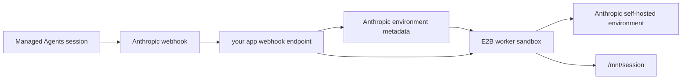

# Python App-Owned Webhook Worker

Use this flow when your application should receive Anthropic webhooks and decide which E2B
sandbox should handle the work. Anthropic calls your app, your app verifies the webhook, then your
app starts or reconnects the E2B worker sandbox.



## Setup

From the parent `python/` directory:

```bash
uv sync
cp .env.template .env
```

Fill in `../.env`:

| Variable | Notes |
| --- | --- |
| `E2B_API_KEY` | Required to start worker sandboxes. |
| `E2B_ACCESS_TOKEN` | Required to build the E2B template. |
| `ANTHROPIC_API_KEY` | Used to verify webhooks, read environment metadata, and update sandbox metadata. |
| `ANTHROPIC_ENVIRONMENT_ID` | Anthropic self-hosted environment id. |
| `ANTHROPIC_ENVIRONMENT_KEY` | Anthropic self-hosted environment key from the [Anthropic Environments workspace](https://platform.claude.com/workspaces/default/environments). |
| `ANTHROPIC_WEBHOOK_SIGNING_KEY` | Required for real webhook deliveries. |

## Build the E2B Template

```bash
make build-template
```

## Run the App Webhook Server

Expose this app endpoint from your own deployment or a tunnel while testing:

```bash
make start-app-webhook-server
```

Register `https://<your-app-host>/webhook` in the
[Anthropic Agents workspace](https://platform.claude.com/workspaces/default/agents) and subscribe it
to `session.status_run_started`.

When Anthropic sends a run-started webhook, the app:

1. Verifies the raw payload with `ANTHROPIC_WEBHOOK_SIGNING_KEY`.
2. Retrieves the Anthropic environment metadata.
3. Reads `e2b_worker_sandbox_id` if one exists.
4. Reconnects to that sandbox and starts the worker if needed.
5. Creates a fresh E2B sandbox and writes new metadata if the stored sandbox id is missing or stale.

## Stop

```bash
make stop-worker SANDBOX_ID=<E2B_WORKER_SANDBOX_ID>
```

For the complete code-level implementation, see [IMPLEMENTATION.md](./IMPLEMENTATION.md).
