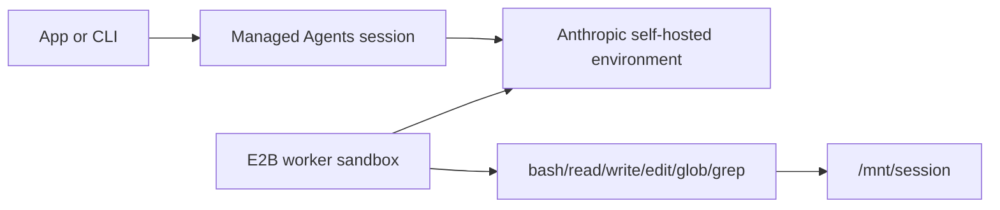

# Managed Agents Worker Orchestrator

Start and manage an [Anthropic Managed Agents](https://platform.claude.com/docs/en/managed-agents/overview)
self-hosted environment worker from your app or CLI.

This is the simplest E2B shape: your host process starts one E2B sandbox from the managed-agents
template, launches Anthropic's `EnvironmentWorker.run()` inside it, then creates Managed Agents
sessions that route tool calls to that worker.



## Setup

Run these commands from this directory. The Python package and `.env` live one level up.

```bash
uv sync --project ..
cp ../.env.template ../.env
```

Fill in `../.env`:

| Variable | Notes |
| --- | --- |
| `E2B_API_KEY` | Required to start worker sandboxes. |
| `E2B_ACCESS_TOKEN` | Required to build the E2B template. |
| `ANTHROPIC_API_KEY` | Used to create environments, agents, and sessions. |
| `ANTHROPIC_ENVIRONMENT_ID` | Printed by `create-environment`. |
| `ANTHROPIC_ENVIRONMENT_KEY` | Generated from the [Anthropic Environments workspace](https://platform.claude.com/workspaces/default/environments). See Anthropic's [environment docs](https://platform.claude.com/docs/en/managed-agents/environments). |
| `ANTHROPIC_AGENT_ID` | Printed by `create-agent`. |

## Create Anthropic Resources

For the Anthropic concepts behind these commands, see the Managed Agents docs for
[environments](https://platform.claude.com/docs/en/managed-agents/environments) and
[agents](https://platform.claude.com/docs/en/managed-agents/agents).

```bash
make create-environment NAME=my-e2b-env
```

Save the printed `ANTHROPIC_ENVIRONMENT_ID`, open the printed URL in the [Anthropic Environments workspace](https://platform.claude.com/workspaces/default/environments), and generate
`ANTHROPIC_ENVIRONMENT_KEY` for the self-hosted environment.

```bash
make create-agent NAME=my-e2b-agent
```

Save the printed `ANTHROPIC_AGENT_ID`.

## Build the E2B Template

```bash
make build-template
```

This bakes the Python package, Anthropic SDK, FastAPI/Uvicorn webhook dependencies, shell tools, and
`/mnt/session` workdir into the `anthropic-managed-agents` E2B template.

## Start a Worker

```bash
make start-worker
```

The command prints `E2B_WORKER_SANDBOX_ID`. Stop that sandbox later with:

```bash
make stop-worker SANDBOX_ID="<sandbox-id>"
```

## Send a Session Message

With the worker running:

```bash
make send
```

Expected event stream signals:

```text
UserToolResultEvent ... text='/mnt/session'
UserToolResultEvent ... text='hello from E2B'
SessionStatusIdleEvent ... stop_reason=EndTurn
```

## Notes

- This is a simple worker demo, not per-session isolation.
- One worker sandbox can service the self-hosted environment. Start more workers for more capacity.
- Tool calls execute inside the E2B sandbox under `/mnt/session`.
- Secrets and Anthropic resource IDs stay runtime-only in `../.env`; they are not baked into the E2B template.
