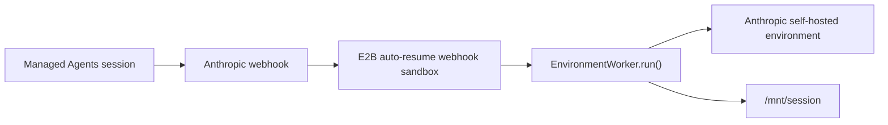

# Managed Agents Webhook Worker

Run the [Anthropic Managed Agents](https://platform.claude.com/docs/en/managed-agents/overview)
webhook receiver inside an auto-resumable E2B sandbox.

This flow is useful when you want Anthropic to wake your E2B worker on demand. Anthropic sends a
`session.status_run_started` webhook, E2B auto-resumes the webhook sandbox, and the webhook handler
starts `EnvironmentWorker.run()` if it is not already running.



## Setup

Run these commands from this directory. The Python package and `.env` live one level up.

```bash
uv sync --project ..
cp ../.env.template ../.env
```

Fill in `.env`:

| Variable | Notes |
| --- | --- |
| `E2B_API_KEY` | Required to start the webhook sandbox. |
| `E2B_ACCESS_TOKEN` | Required to build the E2B template. |
| `ANTHROPIC_ENVIRONMENT_ID` | Anthropic self-hosted environment id. |
| `ANTHROPIC_ENVIRONMENT_KEY` | Anthropic self-hosted environment key from the [Anthropic Environments workspace](https://platform.claude.com/workspaces/default/environments). |
| `ANTHROPIC_WEBHOOK_SIGNING_KEY` | Required for real webhook deliveries. Start once without it to get the URL, then add it. |

## Build the E2B Template

```bash
make build-template
```

This bakes the Python package, Anthropic SDK, FastAPI, Uvicorn, shell tools, and `/mnt/session`
workdir into the `anthropic-managed-agents` E2B template.

## Start the Webhook Sandbox

```bash
make start-webhook-server
```

The command creates an E2B sandbox with:

```python
lifecycle={"on_timeout": "pause", "auto_resume": True}
```

It prints:

```text
E2B_WEBHOOK_SANDBOX_ID=...
Anthropic webhook URL: https://.../webhook
```

The command stores `E2B_WEBHOOK_SANDBOX_ID` on the Anthropic environment metadata as
`e2b_webhook_sandbox_id`. That gives another process a lookup path from
`ANTHROPIC_ENVIRONMENT_ID` to the auto-resumable E2B webhook sandbox:

```bash
make show-environment
```

Create an Anthropic webhook endpoint in the [Anthropic Agents workspace](https://platform.claude.com/workspaces/default/agents) with the printed URL and subscribe it to
`session.status_run_started`. See Anthropic's
[Managed Agents webhook docs](https://platform.claude.com/docs/en/managed-agents/webhooks).
Copy the generated `whsec_...` signing key into
`ANTHROPIC_WEBHOOK_SIGNING_KEY` in `../.env`, then restart the same webhook sandbox so the public
URL stays unchanged:

```bash
make start-webhook-server SANDBOX_ID="<E2B_WEBHOOK_SANDBOX_ID>"
```

The server can start without `ANTHROPIC_WEBHOOK_SIGNING_KEY` so you can get the public E2B URL first.
Until the key is configured, `/webhook` returns `503`.

The webhook sandbox stores its runtime config under `/mnt/session` before starting Uvicorn:

| File | Purpose |
| --- | --- |
| `.anthropic-environment-id` | Anthropic environment to work from. |
| `.anthropic-environment-key` | Environment-scoped worker credential. |
| `.anthropic-webhook-signing-key` | Webhook signature secret, when configured. |
| `.worker-max-idle-seconds` | Worker SDK idle timeout. |
| `.log-level` | Worker log level. |

Each signed `session.status_run_started` event starts a bounded worker process if capacity is
available. The default cap is `MAX_WORKERS=4`; extra starts are retried until a worker exits. Check
the sandbox with:

```bash
curl "https://<sandbox-host>/health"
```

The response includes `worker_running` and `worker_count`.

## Stop the Webhook Sandbox

```bash
make stop-worker SANDBOX_ID="<sandbox-id>"
```

If the stopped sandbox ID matches `e2b_webhook_sandbox_id`, the stop command clears that metadata key.

## Notes

- The webhook server is only the event-driven entrypoint. It still starts the same Anthropic
  `EnvironmentWorker.run()` inside E2B.
- Persistent state is scoped to the webhook sandbox. Files in `/mnt/session` can be shared by any
  session handled by that sandbox's worker pool.
- Tool calls execute inside the E2B sandbox under `/mnt/session`.
- Secrets and Anthropic resource IDs stay runtime-only in `../.env`; they are not baked into the E2B template.

Use `../app-webhooks/` with `APP_SANDBOX_ROUTING_SCOPE=session` when each Managed Agents session
needs its own sandbox and follow-up state.

For a concrete event-by-event walkthrough, see [../EXAMPLE_USAGE.md](../EXAMPLE_USAGE.md).
For a complete code-level implementation, see [IMPLEMENTATION.md](./IMPLEMENTATION.md).
