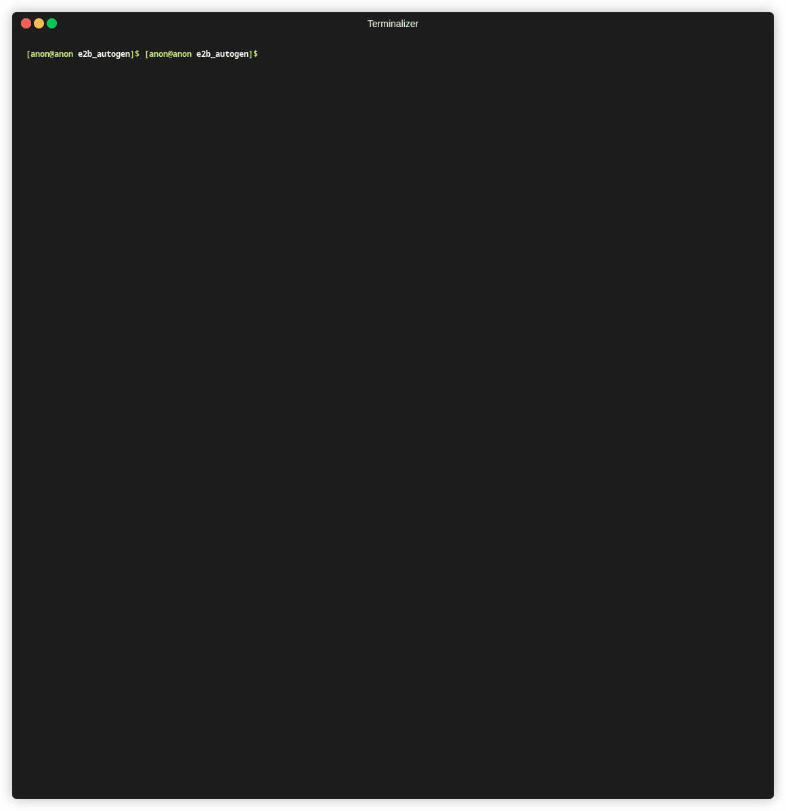
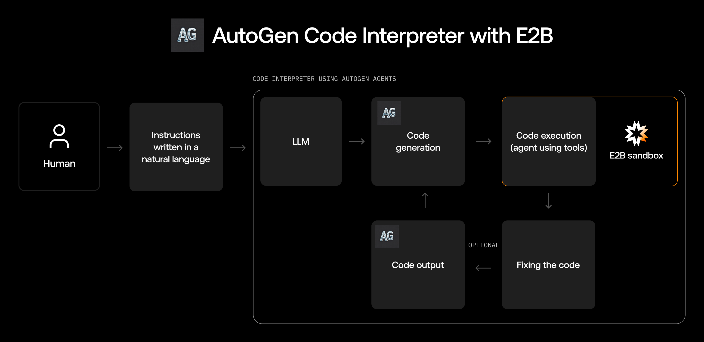

# Example of running code generated by autogen via [E2B sandbox](https://e2b.dev/docs)


## How it works
This code interpreter uses AutoGen agents to define new functions with natural language.
In this example, the agents are given a task to define a function that gets a URL, then prints the response body. The output of this function is then executed in the remote cloud environment, using [E2B sandbox](https://e2b.dev/docs?ref=cookbook).

This example shows the workflow without human (end-user) input, but you can change this setting by changing the `human_input_mode` parameter. To modify the task in this example by modifying the `user_proxy` messages.


## How to run

1. Clone this repository
2. Open the [e2b-cookbook/guides/e2b_autogen](./) directory
3. Install dependencies:
```sh
poetry install
```
4. Rename `.env.example` to `.env` and set up the `OPENAI_API_KEY` key and the `E2B_API_KEY` key. You can get `E2B_API_KEY` at  https://e2b.dev/docs/getting-started/api-key
5. Run `poetry run demo` to launch the demo or `poetry run main` to drop into an interactive session

## Next steps
If you want to build on top of this example, feel free to make a PR to this cookbook. Or discuss your idea with us via [hello@e2b.dev](mailto:hello@e2b.dev).