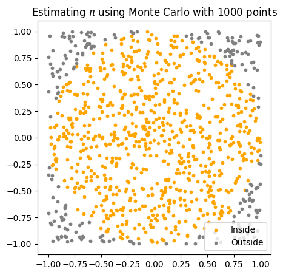

# Claude Code Interpreter in JS/TS
This is an example of running LLM-generated code tasks in a secure and isolated cloud environment using the E2B Code Interpreter SDK.

## Techstack
- [E2B Code Interpreter SDK](https://github.com/e2b-dev/code-interpreter) for running the LLM-generated code
- [Anthropic AI SDK](https://www.npmjs.com/package/@anthropic-ai/sdk) for using Claude as an LLM
- JavaScript/TypeScript

## Setup

### 1. Set up API keys
- Copy `.env.template`   to `.env`
  - Get the [E2B API KEY](https://e2b.dev/docs/getting-started/api-key)
  - Get the [ANTHROPIC API KEY](https://console.anthropic.com/settings/keys)

### 2. Install packages

Install the E2B Code Interpreter SDK and the Anthropic AI SDK.

```
npm i
```

### 3. Run the example

```
npm run start
```


After running the program, you should get the result for an approximate value of pi, and a visualization of the simulation in a `image.png` file.



If you encounter any problems, please let us know at our [Discord](https://discord.com/invite/U7KEcGErtQ).

If you want to let the world know about what you're building with E2B, tag [@e2b_dev](https://twitter.com/e2b_dev) on X (Twitter).

### 4. Visit our docs
Check the [documentation](https://e2b.dev/docs) to learn more about how to use E2B.