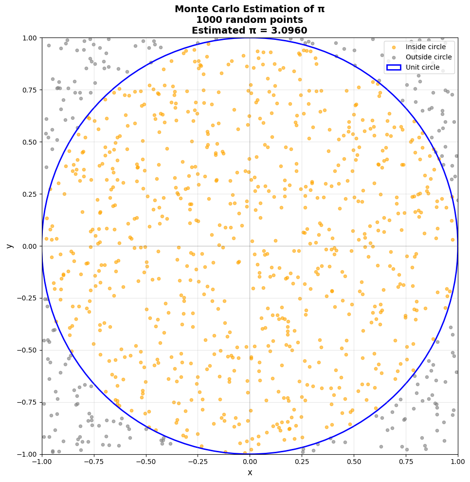

# Claude Code Interpreter in Python
This is an example of running LLM-generated code tasks in a secure and isolated cloud environment using the E2B Code Interpreter SDK.

## Techstack
- [E2B Code Interpreter SDK](https://github.com/e2b-dev/code-interpreter) for running the LLM-generated code
- [Anthropic AI SDK](https://github.com/anthropics/anthropic-sdk-python) for using Claude as an LLM
- Python with Poetry for dependency management

## Setup

### 1. Set up API keys
- Copy `.env` from the root of the repository or create your own:
  ```bash
  cp ../../.env .env
  ```
- Get the [E2B API KEY](https://e2b.dev/docs/getting-started/api-key)
- Get the [ANTHROPIC API KEY](https://console.anthropic.com/settings/keys)

### 2. Install Poetry
If you don't have Poetry installed:
```bash
curl -sSL https://install.python-poetry.org | python3 -
```

### 3. Install dependencies
```bash
poetry install
```

### 4. Run the example
```bash
poetry run python main.py
```

## What it does

After running the program, you should get:
- A calculation of pi using the Monte Carlo method with 1000 iterations
- A visualization showing all points from the simulation
- Points inside the unit circle are colored **orange**
- Points outside the unit circle are colored **grey**
- The result saved to `output.png`



## Features

This example demonstrates:
- **Multi-turn conversation**: Claude can make multiple tool calls in sequence
- **Code execution in E2B sandbox**: All Python code runs securely in an isolated cloud environment
- **Data visualization**: Generates matplotlib charts and saves them as images
- **Monte Carlo simulation**: Statistical method for estimating π

## How it works

The program uses Claude with a custom `execute_python` tool that:
1. Takes Python code as input
2. Executes it in an E2B sandbox (isolated Jupyter environment)
3. Returns results, stdout, stderr, and any generated visualizations
4. Continues the conversation allowing Claude to make additional tool calls

The conversation loop enables Claude to:
- First execute code to calculate pi
- Then execute more code to create the visualization
- Continue until the task is complete

## Troubleshooting

If you encounter any problems, please let us know at our [Discord](https://discord.com/invite/U7KEcGErtQ).

If you want to let the world know about what you're building with E2B, tag [@e2b_dev](https://twitter.com/e2b_dev) on X (Twitter).

## Learn more

Check the [documentation](https://e2b.dev/docs) to learn more about how to use E2B.
