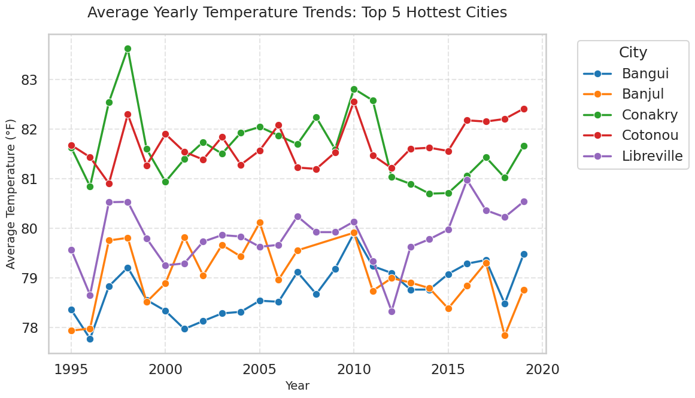

# Data Analysis and Visualization with Google Gemini

This is an example that tests the capabilities of Google's Gemini models. You can choose from models like gemini-3-flash-preview. We let the LLM write the code to analyze a dataset from Kaggle and generate visualizations. We use the E2B Code Interpreter SDK for running the LLM-generated code tasks in a secure and isolated cloud environment.

## Tech Stack
- [E2B Code Interpreter SDK]((https://github.com/e2b-dev/code-interpreter)) for running the LLM-generated code
- [Gemini's 3.0 Flash](https://ai.google.dev/gemini-api/docs/models) as an LLM
- JavaScript/TypeScript


## Setup
### 1. Set up API keys
1. Copy the `.env.template` file to `.env`:
   ```bash
   cp .env.template .env
   ```

2. Get your [E2B API key](https://e2b.dev/docs/getting-started/api-key) and [Google AI Studio API key](https://aistudio.google.com/).

3. Add your API keys to the `.env` file.

4. Install the dependencies:
   ```bash
   npm install
   ```

5. Run the example:
   ```bash
   npm start
   ```

After running the program, you should get the results of a chart visualizing the yearly temperature trends in the top 5 hottest cities.



If you encounter any problems, please let us know at our [Discord]((https://discord.com/invite/U7KEcGErtQ)).
If you want to let the world know about what you're building with E2B, tag [@e2b_dev](https://twitter.com/e2b_dev) on X (Twitter).

### 4. Visit our docs
Check the documentation to learn more about how to use E2B. [Visit our docs](https://e2b.dev/docs).