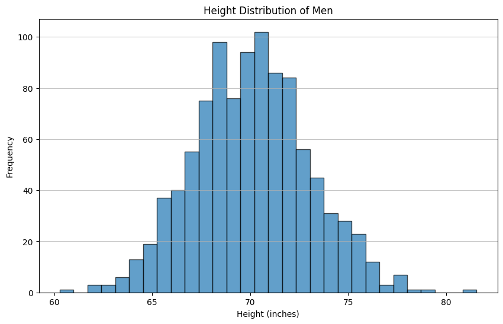

# GPT-4o Code Interpreter in JS/TS
This is an example that tests the capabilities of the OpenAI's GPT-4o model. We let it generate a chart and reason about it. We use the E2B Code Interpreter SDK for running the LLM-generated code tasks in a secure and isolated cloud environment.


## Tech Stack
- [E2B Code Interpreter SDK]((https://github.com/e2b-dev/code-interpreter)) for running the LLM-generated code
- [OpenAI's GPT-4o](https://openai.com/index/hello-gpt-4o/) as an LLM
- JavaScript/TypeScript

## Setup
### 1. Set up API keys
- Copy `.env.template` to `.env`
- Get the [E2B API KEY]((https://e2b.dev/docs/getting-started/api-key))
- Get the [OPENAI API KEY](https://platform.openai.com/settings)

### 2. Install packages
Install the E2B Code Interpreter SDK and the OpenAI SDK.

```
npm i
```
### 3. Run the example
```
npm run start
```

After running the program, you should get the result for an approximate value of pi, and a visualization of the simulation in an `image.png` file.



If you encounter any problems, please let us know at our [Discord]((https://discord.com/invite/U7KEcGErtQ)).

If you want to let the world know about what you're building with E2B, tag [@e2b_dev](https://twitter.com/e2b_dev) on X (Twitter).

### 4. Visit our docs
Check the documentation to learn more about how to use E2B. [Visit our docs](https://e2b.dev/docs).

This format will display correctly as Markdown on platforms such as GitHub, providing a structured and easy-to-read documentation for your project.