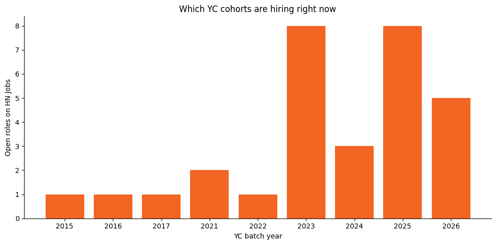

# Scrape and analyze YC job listings with Olostep and E2B

Scrape [Hacker News Jobs](https://news.ycombinator.com/jobs) with [Olostep](https://olostep.com), then parse and chart the results inside an [E2B](https://e2b.dev) sandbox.



## What this shows

Olostep returns any page as clean LLM-ready markdown in a single API call. The E2B sandbox then runs untrusted parsing and plotting code against that markdown in an isolated VM — no local Python setup, no dependency conflicts, and nothing from the scraped page touching your machine.

The extraction happens with a regex inside the sandbox rather than through an LLM. For a page with predictable structure this is deterministic, free, and instant, and it keeps the example runnable with just two API keys.

## Prerequisites

- Node.js 18+
- An [Olostep API key](https://olostep.com)
- An [E2B API key](https://e2b.dev/dashboard)

## Setup

```bash
git clone https://github.com/e2b-dev/e2b-cookbook.git
cd e2b-cookbook/examples/olostep-scrape-and-analyze
npm install
```

Copy the env file and add your keys:

```bash
cp .env.example .env
```

```
E2B_API_KEY=e2b_***
OLOSTEP_API_KEY=***
```

## Run

```bash
npm start
```

Output:

```
Scraping with Olostep...
Got 7195 chars of markdown
parsed 30 listings
       company yc_batch  days_ago
       Tasklet      P26         3
    Gooseworks      W23         3
       Voltair      W26         4

median days since posting: 19
Saved chart.png
```

## How it works

`scraping.ts` posts the URL to Olostep's `/v1/scrapes` endpoint and asks for markdown:

```ts
body: JSON.stringify({ url_to_scrape: url, formats: ["markdown"] })
```

`index.ts` writes that markdown into a fresh E2B sandbox, runs `analyze.py` inside it, and pulls the resulting chart back out as a PNG.

`analyze.py` extracts each listing's company, YC batch, and posting age, then plots open roles by batch year.

## Files

| File | Purpose |
|---|---|
| `scraping.ts` | Olostep API call |
| `index.ts` | Sandbox orchestration |
| `analyze.py` | Parsing and plotting, runs inside the sandbox |