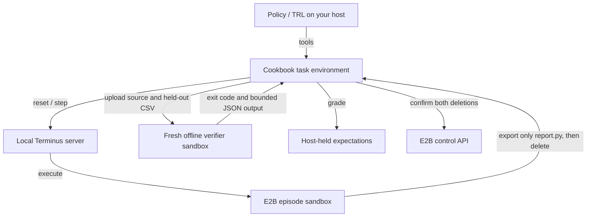

# Multi-turn code repair with OpenEnv Terminus and E2B

Repair a CSV report across several terminal calls, then check its submitted source against a separate CSV in a fresh sandbox. [OpenEnv](https://github.com/huggingface/OpenEnv) supplies the native reset/step protocol; its [Terminus environment](https://github.com/huggingface/OpenEnv/tree/v0.8.0/envs/terminus_env) supplies E2B execution. Files persist within an episode, and reset creates a fresh sandbox. The OpenEnv server stays on your machine. No Docker, model key or GPU is needed for the first result.

This is useful when a policy must inspect existing files, execute a program, edit it and check its work. E2B isolates that executable episode from your trainer host; model inference and optimization stay on your infrastructure.

## Where the components run



The local Terminus server creates and executes the policy workspace. The cookbook manages submission through the E2B SDK and keeps grading expectations on the host. TRL supplies the optional model/tool loop and optimizer.

## Run your first repair episode

Requires Python 3.12 or 3.13, [uv](https://docs.astral.sh/uv/getting-started/installation/), Git and an [E2B API key](https://console.e2b.dev). The demo creates four short-lived sandboxes sequentially: a policy workspace and a fresh verifier for each of two episodes. Sandbox usage consumes credits.

### Install and start the server

From this example directory:

```bash
uv sync --frozen
cp .env.example .env
```

Set `E2B_API_KEY` in `.env`. Keep it on the host; `.env` is ignored by Git. `uv.lock` pins OpenEnv 0.8.0, E2B 2.53.1, Code Interpreter 2.10.3 and a tested upstream Terminus source revision. The native Terminus package is installed from Git, rather than a separate PyPI package.

Start the local server in one terminal:

```bash
uv run --frozen uvicorn server:app --host 127.0.0.1 --port 8010
```

### Run the demo and read its receipt

From the same directory in a second terminal:

```bash
uv run --frozen main.py
```

[main.py](./main.py) first submits the buggy program. The second episode starts from the same fresh fixture, inspects and runs it, fixes the aggregation, reruns and submits. Expected repaired output on the visible CSV:

```json
{"east": 15, "west": 7}
```

The buggy report has `east=5`: it replaces the earlier value instead of adding it. The receipt contains `rewards: [0.0, 1.0]`, two policy IDs and two verifier IDs, per-operation durations, resource sizes and `confirmed absent` cleanup entries. Each terminal step runs in the policy sandbox created by its own reset. Stop the local server with Ctrl-C after the clients finish.

## Understand the example code

### Server, environment and trainer ownership

| Source | What it owns |
| --- | --- |
| [server.py](./server.py) | Loads the host key and exposes the native `TerminusEnvironment` through OpenEnv, with two concurrent environment sessions. The run command binds it to loopback. |
| [episode.py](./episode.py) | `ReportEpisode`: trusted task data, native client, policy/verifier IDs, deadlines, host grading and explicit deletion confirmation. Construction allocates nothing. |
| [train.py](./train.py) | Dataset and `GRPOConfig`, an `environment_factory` that creates environment objects, native `GRPOTrainer`, the final model save and outer cleanup. TRL owns generation, tool observations, token masks and optimizer work. |

### From reset to reward

| Method in `ReportEpisode` | Execution and result |
| --- | --- |
| `reset(task=...)` | Closes any earlier resource, calls native reset with trusted setup and `verify=["true"]`, records the policy ID, extends its lifetime and attaches the sandbox connection before policy execution. Installs the buggy program and visible CSV. |
| `terminal(command)` | Sends a bounded shell command through native `step(CallToolAction(...))`; returns command output. Files persist across calls. |
| `submit()` | Blocks further mutations, exports the source, deletes the policy sandbox and evaluates in a fresh verifier. Commits the host score after both deletions are confirmed. |
| `get_reward()` | Returns the committed score. Without submission, checks the policy sandbox before returning zero and closes it. Recorded infrastructure failures raise again here. |

Direct native MCP `call_tool()` skips OpenEnv's step postprocessing. This bridge uses native `step` for terminal actions. Its configured `verify=["true"]` does not supply the task score: cookbook `submit()` handles verification through the SDK and ends the episode locally. Native reward is never the cookbook task score.

## Submit and grade in a fresh sandbox

### Export only the declared solution

Submission reads `/home/user/work/report.py` through the E2B file API with a 64 KiB limit and 10-second transfer deadline. The policy sandbox is confirmed deleted before verification starts. Its companion files, modified binaries, environment and background processes are not copied; the exported source is the candidate being graded.

### Run against a separate input

The bridge creates one verifier from the actual policy template with outbound access disabled, records its ID before further initialization and uploads the source plus `verification.input`. It executes a fixed Python command under the sandbox-side timeout. Output is redirected to sandbox files and read with the same size cap, keeping candidate output out of an unbounded host buffer.

### Accept the host score after cleanup

The host requires exit code zero and exactly the integer totals in `verification.expected`. A missing/oversized source needs no verifier. A failing exit, shell timeout, malformed/oversized output or incorrect report gets zero. SDK creation/transport failures and unresolved cleanup abort scoring; they cannot become a zero-score sample. The host confirms verifier deletion before committing the result.

| Action or outcome | Observation | Task reward |
| --- | --- | --- |
| Inspect source and CSV | Assignment overwrites repeated regions | Pending |
| Run buggy report | `{"east": 5, "west": 7}` | Pending |
| Submit without repair | Separate CSV totals do not match | `0.0` |
| Edit to accumulate; run; submit | Visible `{"east": 15, "west": 7}`; verification `{"north": 11, "south": 5}` | `1.0` |
| Healthy episode ends without submission | Resource health confirmed, then cleanup | `0.0` |
| Submitted program fails or hits its shell timeout | Non-zero verifier exit | `0.0` |
| Resource/transport loss, episode deadline or unresolved cleanup | Infrastructure error | No score; abort run |

OpenEnv 0.8.0 reads a policy-writable `/home/user/logs/verifier/reward.txt`, which a background writer can forge. This recipe ignores it in both sandboxes. The fresh verifier does not inherit policy state, but the submitted candidate remains untrusted executable code. A visible-answer hardcode fails the separate input; both fixed fixtures are public in [task.json](./task.json), so hardcoding both remains possible. This is a bounded task check, not a secret benchmark or proof of generalization.

## Adapt the task

### Task schema

[task.json](./task.json) is trusted orchestration data:

| Field | Meaning |
| --- | --- |
| `id` | Task identifier |
| `input` | Visible CSV uploaded during reset |
| `expected` | Reference totals for the visible example; host grading uses `verification.expected` |
| `verification.input` | Separate CSV uploaded only to the fresh verifier |
| `verification.expected` | Exact integer verification totals retained on the host |
| `prompt` | Instructions sent to the policy |

The training dataset has `prompt` (chat messages) and `task` (this object) columns. TRL forwards `task` to reset. Only `terminal(command)` and `submit()` are advertised as model tools; setup, reset, credentials, expected totals and cleanup remain orchestration controls.

### Customize the repair

Change the visible and verification CSV/expectation pairs and the prompt together. Include repeated regions so the current overwrite bug still fails. For a different defect, update `BUGGY` in [episode.py](./episode.py), the scripted repair in [main.py](./main.py) and the focused tests. The program must read the fixed `sales.csv` path and print one JSON object with integer values.

Keep grading outcomes in trusted orchestration. For a model evaluation, use varied tasks and separate evaluation data; two fixed public fixtures cannot establish a general repair capability.

## Connect the environment to TRL

### Choose and install the model path

Keep the local server running and install the training extra:

```bash
uv sync --frozen --extra training
```

Set `MODEL_PATH` to a tool-capable local Transformers checkpoint or Hugging Face model ID with a compatible chat template and response parser. Then run on your own compute:

```bash
uv run --frozen --extra training train.py --model "$MODEL_PATH"
```

There is no default model or measured pretrained success rate. Transformers >=5.2 must parse generated tool calls. `--cpu` is available for local wiring checks; compute requirements for practical training depend on the chosen checkpoint.

### Factory and native tool loop

In [train.py](./train.py), the factory creates a `ReportEpisode` and adds it to the list TRL manages. TRL 1.14.2's experimental `GRPOTrainer(environment_factory=...)` discovers its typed tool methods, resets one environment per completion, runs generated tool calls, appends observations and collects the score through `get_reward()`.

TRL pools Python environment instances and can reset or execute tools serially. This is an object pool; each reset creates a new E2B policy sandbox. Submission deletes both resources and blocks further mutations. TRL's tool-loop and completion-token limits still control the end of generation. The training `finally` closes every environment again.

### Configuration and output artifacts

| Setting in [train.py](./train.py) | Default and effect |
| --- | --- |
| `num_generations`, `per_device_train_batch_size` | Two completions per prompt and a batch of two completions |
| `max_completion_length` | 512 completion tokens, bounding the generated tool conversation |
| `learning_rate` | `1e-6` |
| `--max-steps` | One optimizer step by default |
| `--cpu` / `bf16` | CPU mode disables BF16; the normal path requests BF16 |
| `--output-dir` | `training-output` by default |
| `save_strategy`, `report_to` | No periodic checkpoint save or external experiment reporting |

After successful `trainer.train()`, the explicit model save writes `training-output/checkpoint` (or `checkpoint` under your output directory). It saves the model for later loading; the script does not save optimizer state for a resumed run. The final stdout JSON contains aggregated operation traces and cleanup entries, including the policy and verifier IDs. Full generated-conversation logging is not enabled by default; short runs can finish before TRL's usual metric logging interval.

### Check the reward signal

Inspect operation traces to confirm tool execution and submission. GRPO compares rewards within a completion group: identical rewards supply no difference to learn from. An initial run can finish with all rewards zero and `train_loss=0`. Check tool parsing/submission, inspect candidate failures and adjust task or prompting until some completions succeed and others fail before measuring learning.

TRL can catch a tool exception and show it to the model. The bridge remembers infrastructure failures and raises again at reward collection so they stay out of training data. A completed shell error remains a policy observation; a failed submitted candidate gets zero.

The offline training check uses generated tiny CPU weights, scripted tool tokens and synthetic rewards with a real optimizer update. Live E2B checks separately exercise the shipped bridge. These establish wiring; pretrained behavior, GPU performance and learning improvement remain unmeasured. The [integration guide](https://docs.e2b.dev/agents/openenv) explains metric interpretation and comparison with the same workload.

## Lifecycle and failures

### State and reset

One policy sandbox holds files across terminal steps. Each call starts a new shell process: `cd` and exports do not persist, so use absolute paths. Reset replaces the whole resource; clearing files in place would leave background processes running. Sandbox absence or expiry is fatal. Health is checked around operations and before accepting a no-submission zero. Submission never reconnects or resumes the policy resource; a committed score remains readable after deletion.

### Timeout budgets and cancellation

| Budget | Value | What it bounds |
| --- | --- | --- |
| Native policy lifetime / host extension | 300 s / 600 s | Initial allocation backstop / remote policy resource after its ID arrives |
| Local episode deadline | 120 s | Creation, batch waiting, generation, tools, verification and cleanup before score commit |
| Sandbox-side command limit | 10 s | An ordinary shell command or submitted report |
| Native client message timeout | 25 s | Waiting for an OpenEnv response |
| Verifier lifetime / SDK command timeout | 120 s / 20 s | Fresh resource / command response |
| File transfer deadline and cap | 10 s / 64 KiB | Each exported source or output read |

Commands run under `timeout --signal=KILL`. A completed shell error or timeout is returned to the policy, which may repair its program before submission. Printed output such as `ERROR: SystemExit: 137` is never infrastructure evidence.

A lost response or local cancellation leaves remote execution uncertain. The episode stops scoring and removes its known resources; it never replays that step or blindly creates a replacement. Detached processes can outlive the shell limit, so cleanup deletes the whole sandbox. A lost reset response can leave an unknown allocation until the native lifetime expires; the error reports that uncertainty.

### Cleanup and reconciliation

Client close can suppress server teardown errors in released OpenEnv. `_close()` therefore explicitly deletes each acquired ID, checks for absence and retries deletion up to three times for the same known owned resource. It retains unresolved IDs and fails visibly. Cleanup covers subsequent initialization failures and runs again in outer `finally` blocks. It never deletes unrelated account resources.

Ctrl-C runs Python cleanup; an abrupt host kill can require manual reconciliation. Keep the E2B key on the host. The policy sandbox retains native template networking, while the verifier has outbound access disabled. The OpenEnv server binds to loopback.

## Troubleshooting

| Symptom | Meaning and next step |
| --- | --- |
| Client cannot connect to port 8010 | Start the documented local server, inspect its startup log and use the same example environment. |
| `reset failed` or setup status is not ready | Check the host `.env`, key and server log. Treat this as infrastructure; reconcile any returned owned ID before rerunning. |
| No submission or all rewards are zero | Inspect the final operation trace, model tool-call compatibility and submitted code. Healthy no-submission is zero; identical group rewards can yield zero loss. |
| A terminal call returns an error or shell timeout | Inspect the observation and fix the program before submitting. The completed command response does not abort the rollout. |
| Submitted report gets zero | Check aggregation on both CSV shapes, exit status and output format/size. A submitted episode is finished; the next reset starts a new attempt. |
| Resource loss, response timeout or `Episode deadline exceeded` | The bridge aborts scoring and cleans up; diagnose the infrastructure/budget before starting a new episode. |
| `Cleanup unresolved: <owned ID>` | Check and delete that owned resource in the [E2B console](https://console.e2b.dev), confirm absence and preserve the reported ID for reconciliation. |

## Scale and cost

Submitted episodes use two allocations; no-submission episodes use one. The local server's two-session cap and allocation pacing do not coordinate other processes. Check project-wide [billing and limits](https://docs.e2b.dev/billing) when adding workers. The E2B SDK honors `Retry-After` for 429 responses; avoid replaying an uncertain episode.

Measure startup, model waiting, tool turns, submission and optimizer time separately. Estimate compute from actual resources and full running lifetimes across both roles, including model waiting and cleanup. `confirmed_at - started_at` is a conservative lifetime estimate, not an exact stop timestamp. GPU/model compute, subscriptions and optional add-ons are separate.

### Example measured smoke run — 2026-10-09

One bounded run used two sequential episodes with a separate policy and verifier sandbox per episode, each with 2 vCPU / 2 GiB, native OpenEnv 0.8.0, a local loopback server and the pinned lockfile. It returned `[0, 1]` in 16.534 seconds with four allocations:

| Measured operation | Samples | Observed range |
| --- | --- | --- |
| Reset including setup/control attachment | 2 | 1.982–2.425 s |
| Terminal step including control checks | 6 | 0.378–0.894 s |
| Submission: export, policy cleanup, verifier create/run/cleanup | 2 | 3.960–4.027 s |
| Resource lifetime through cleanup confirmation | 4 | 2.228–6.257 s |

Summed lifetime upper bound: 15.744 sandbox-seconds. At the [pricing page](https://e2b.dev/pricing)'s rates checked that day ($0.000014/vCPU/s and $0.0000045/GiB/s), estimated compute upper bound was $0.000583 for the two episodes. This dated sample demonstrates the calculation; it is not an invoice, a fixed default price, provider latency benchmark, training result or scale projection. Recheck current rates and your actual workload/resources.

## Other rollout and training paths

Native Terminus already includes E2B and runs its server locally. For a task packaged as a Docker environment, follow that environment's deployment path. [OpenEnv Harbor](https://github.com/huggingface/OpenEnv/tree/v0.8.0/src/openenv/harbor) drives a complete coding-agent harness rollout with different task/template and token-capture prerequisites. Native Jupyter shares mutable policy-kernel state, so task verification belongs outside that kernel.

For managed compute, see the [Fireworks Training API RL](https://docs.fireworks.ai/fine-tuning/training-api/cookbook/rl) and [agentic RL](https://docs.fireworks.ai/fine-tuning/training-api/cookbook/agentic-rl) recipes. Their contract requires exact token IDs, aligned log probabilities and masks; it needs a separate rollout adapter.

## Offline checks

```bash
uv run --frozen pytest -q
uv run --frozen ruff check .
```

The core suite creates no sandbox and calls no model. With the training extra installed, it also runs the tiny CPU wiring check. The root cookbook upload-and-run suite excludes this host-side server example, which would otherwise nest sandboxes and require a long-lived local service.
