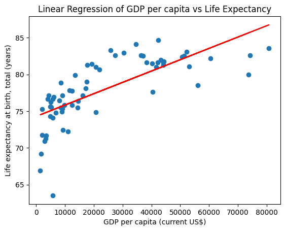

# AI Code Execution with Together AI models

This AI data analyst can plot a linear regression chart based on CSV data. It uses Together AI LLMs, and the [E2B Templates SDK](https://github.com/e2b-dev/E2B) by E2B for the code interpreting capabilities. The SDK quickly creates a secure cloud sandbox powered by [Firecracker](https://github.com/firecracker-microvm/firecracker). Inside this sandbox is a running Jupyter server that the LLM can use.

Read more about Together AI models [here](https://api.together.ai/models).

The AI agent performs a data analysis task on an uploaded CSV file, executes the AI-generated code in the sandboxed environment by E2B, and returns a chart, saving it as a PNG file. The code is processing the data in the CSV file, cleaning the data, and performing the assigned analysis, which includes plotting a chart.

# How to start

## 1. Install dependencies

Ensure all dependencies are installed:

```
npm install
```

## 2. Set up environment variables

Create a `.env` file in the project root directory and add your API keys:

- Copy `.env.template` to `.env`
- Get the [E2B API KEY](https://e2b.dev/docs/getting-started/api-key)
- Get the [TOGETHER AI API KEY](https://api.together.xyz/settings/api-keys)

## 3. Choose your LLM

In the `index.ts` file, uncomment the model of your choice. The recommended code generation models to choose from are:
- [Meta Llama 3.1 8B or 70B or 405B Instruct Turbo](https://api.together.ai/models/meta-llama/Meta-Llama-3.1-405B-Instruct-Turbo)
- [Qwen 2 Instruct (72B)](https://api.together.ai/playground/chat/Qwen/Qwen2-72B-Instruct)
- [Code Llama Instruct (70B)](https://api.together.ai/models/codellama/CodeLlama-70b-Instruct-hf)
- [DeepSeek Coder Instruct (33B)](https://api.together.ai/playground/chat/deepseek-ai/deepseek-coder-33b-instruct)

See the complete list of Together AI models [here](https://api.together.ai/models).

## 4. Run the program

```
npm run start
```

The script performs the following steps:
    
- Loads the API keys from the environment variables.
- Uploads the CSV dataset to the E2B sandboxed cloud environment.
- Sends a prompt to the model to generate Python code for analyzing the dataset.
- Executes the generated Python code using the E2B Templates SDK.
- Saves any generated visualization as a PNG file.
  

After running the program, you should get the result of the data analysis task saved in an `image_1.png` file. You should see a plot like this:




# Connect with E2B & learn more
If you encounter any problems, please let us know at our [Discord](https://discord.com/invite/U7KEcGErtQ).

Check the [E2B documentation](https://e2b.dev/docs) to learn more about how to use the E2B Templates SDK.