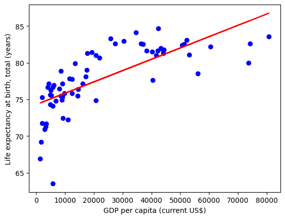

# AI Code Execution with Together AI models

This AI data analyst can plot a linear regression chart based on CSV data. It uses Together AI LLMs, and the [Code Interpreter SDK](https://github.com/e2b-dev/code-interpreter) by E2B for the code interpreting capabilities. The SDK quickly creates a secure cloud sandbox powered by [Firecracker](https://github.com/firecracker-microvm/firecracker). Inside this sandbox is a running Jupyter server that the LLM can use.

The AI agent performs a data analysis task on an uploaded CSV file, executes the AI-generated code in the sandboxed environment by E2B, and returns a chart, saving it as a PNG file. The code is processing the data in the CSV file, cleaning the data, and performing the assigned analysis, which includes plotting a chart.

# How to start

## 1. Load API keys

Add your API keys to the corresponding part of the notebook.

- Get the [E2B API KEY](https://e2b.dev/docs/getting-started/api-key)
- Get the [TOGETHER AI API KEY](https://api.together.xyz/settings/api-keys)

## 2. Choose your LLM

In the Python notebook, uncomment the model of your choice. The recommended code generation models to choose from are:
- [Llama 3.3 70B Instruct Turbo](https://api.together.ai/models/meta-llama/Llama-3.3-70B-Instruct-Turbo)
- [Qwen 3.7 Plus](https://api.together.ai/models/Qwen/Qwen3.7-Plus) and [Qwen 3.6 Plus](https://api.together.ai/models/Qwen/Qwen3.6-Plus)
- [DeepSeek V4 Pro](https://api.together.ai/models/deepseek-ai/DeepSeek-V4-Pro) and [DeepSeek V4 Flash](https://api.together.ai/models/deepseek-ai/DeepSeek-V4-Flash-0731)
- [Qwen 2.5 7B Instruct Turbo](https://api.together.ai/models/Qwen/Qwen2.5-7B-Instruct-Turbo)

See the complete list of Together AI models [here](https://api.together.ai/models).

## 3. Run the notebook

The script performs the following steps:
    
- Loads the API keys from the environment variables.
- Uploads the CSV dataset to the E2B sandboxed cloud environment.
- Sends a prompt to the model to generate Python code for analyzing the dataset.
- Executes the generated Python code using the E2B Code Interpreter SDK.
- Saves any generated visualization as a PNG file.
  

After running the notebook, you should get the result of the data analysis task saved in an `image_1.png` file. You should see a plot like this:

# Connect with E2B & learn more
If you encounter any problems, please let us know at our [Discord](https://discord.com/invite/U7KEcGErtQ).

Check the [E2B documentation](https://e2b.dev/docs) to learn more about how to use the Code Interpreter SDK.