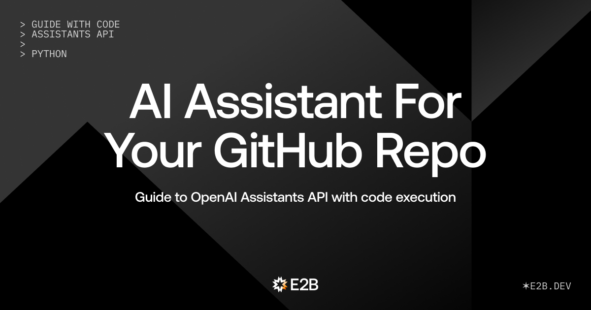
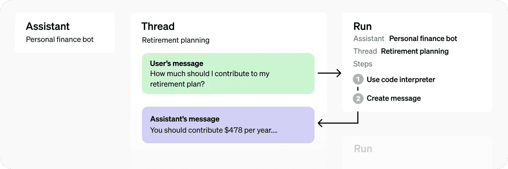

# AI GitHub Developer

## Python guide with complete code



We are E2B. We provide sandboxed cloud environments made for AI agents and AI apps. Try our Custom Sandboxes and support us on GitHub with a star if you like it. E2B sandboxes work with any LLM - we also support the new Assistants API.

---

> 🏁 **Final code:** [E2B Cookbook - OpenAI Assistant](https://github.com/e2b-dev/e2b-cookbook/tree/main/guides/openai-assistant-py/openai_assistant)

---

## What we will do

In this guide, we will build a custom AI agent that will clone our GitHub repository to its remote cloud environment, work on the repo there, and then commit the changes to GitHub.

We will use the E2B Sandboxes for the remote execution of tasks, together with the Assistants API by OpenAI. The crucial concept from OpenAI we will use is Function Calling.

> You can find the final code [here](https://github.com/e2b-dev/e2b-cookbook/tree/main/guides/openai-assistant-py/openai_assistant)
. All links to particular parts of code in this post refer to the corresponding code on GitHub.


### Prerequisites

We are using two key concepts:
1. **OpenAI API** - Find your API key [here](https://platform.openai.com/api-keys), read the intro to the Assistants API, and Function Calling.
2. **E2B Sandbox** - Find your (free) API key [here](https://e2b.dev/docs/getting-started/api-key), read the intro to the E2B Sandboxes.

Sign up via E2B docs to get your free API key for using sandboxes.

---


## 1. Create files

We create three files - `main.py`, `assistant.py` for defining the assistant's behavior, and `actions.py` for defining actions (Python functions) it can use.

---

## 2. Define actions for the assistant

In the `actions.py` file, we will define Python functions as runnable actions for the AI assistant and the LLM.

We first import the e2b Sandbox.

> Here we are using the default sandbox. For different use cases, we could use different custom sandboxes, for example, a code interpreter sandbox useful for advanced data analysis.

```python
import os
import random
import string
from typing import Any, Dict
from e2b import Sandbox
from rich.console import Console
from rich.theme import Theme
```
We determine the directory where we clone the repo in the sandbox. We pick theme for printing the sandbox actions.

```python
REPO_DIRECTORY = "/home/user/repo"

custom_theme = Theme(
    {
        "sandbox_action": "bold #E57B00",  # Adjust color as needed
    }
)

console = Console(theme=custom_theme)

def print_sandbox_action(action_type: str, action_message: str):
    console.print(
        f"[sandbox_action] [Sandbox Action][/sandbox_action] {action_type}: {action_message}"
    )
```
Then we define actions. Each action corresponds to one OpenAI Function that the assistant is equipped with (see the next steps.)

We are defining six actions in total which allow us:
1. Create directory in the remote sandbox such that the assistant can work on the cloned repo
2. Save content (e.g., code) to a file
3. List files in a directory
4. Read files' content
5. Commit changes
6. Make a pull request

> Modify the program by adding more actions for your specific use case in the same principle.

Actions are Python functions that will be executed remotely in the sandbox by the AI assistant. For each we need to specify arguments, and add a string indicating success or an error message.

```python
def create_directory(sandbox: Sandbox, args: Dict[str, Any]) -> str:
    directory = args["directory"]
    print_sandbox_action("Creating directory", directory)

    try:
        sandbox.filesystem.make_dir(directory)
        return "success"
    except Exception as e:
        return f"Error: {e}"


def save_content_to_file(sandbox: Sandbox, args: Dict[str, Any]) -> str:
    path = args["path"]
    content = args["content"]
    print_sandbox_action("Saving content to", path)

    try:
        dir = os.path.dirname(path)
        sandbox.filesystem.make_dir(dir)
        sandbox.filesystem.write(path, content)
        return "success"
    except Exception as e:
        return f"Error: {e}"


def list_files(sandbox: Sandbox, args: Dict[str, Any]) -> str:
    path = args["path"]
    print_sandbox_action("Listing files on path", path)

    try:
        files = sandbox.filesystem.list(path)
        response = "\n".join(
            [f"dir: {file.name}" if file.is_dir else file.name for file in files]
        )
        return response
    except Exception as e:
        return f"Error: {e}"


def read_file(sandbox: Sandbox, args: Dict[str, Any]) -> str:
    path = args["path"]
    print_sandbox_action("Reading file on path", path)

    try:
        return sandbox.filesystem.read(path)
    except Exception as e:
        return f"Error: {e}"


def commit(sandbox: Sandbox, args: Dict[str, Any]) -> str:
    repo_directory = "/home/user/repo"
    commit_message = args["commit_message"]
    print_sandbox_action("Committing with the message", commit_message)

    git_add_proc = sandbox.process.start_and_wait(f"git -C {repo_directory} add .")
    if git_add_proc.exit_code != 0:
        error = f"Error adding files to staging: {git_add_proc.stdout}\n\t{git_add_proc.stderr}"
        console.print("\t[bold red]Error:[/bold red]", error)
        return error

    git_commit_proc = sandbox.process.start_and_wait(
        f"git -C {repo_directory} commit -m '{commit_message}'"
    )
    if git_commit_proc.exit_code != 0:
        error = f"Error committing changes: {git_commit_proc.stdout}\n\t{git_commit_proc.stderr}"
        console.print("\t[bold red]Error:[/bold red]", error)
        return error

    return "success"


def make_pull_request(sandbox: Sandbox, args: Dict[str, Any]) -> str:
    base_branch = "main"

    random_letters = "".join(random.choice(string.ascii_letters) for _ in range(5))
    new_branch = f"ai-developer-{random_letters}"

    title = args["title"]
    body = args["body"]

    print_sandbox_action(
        "Making a pull request", f"from '{new_branch}' to '{base_branch}'"
    )

    git_checkout_proc = sandbox.process.start_and_wait(
        f"git -C {REPO_DIRECTORY} checkout -b {new_branch}"
    )
    if git_checkout_proc.exit_code != 0:
        error = f"Error creating a new git branch {new_branch}: {git_checkout_proc.stdout}\n\t{git_checkout_proc.stderr}"
        console.print("\t[bold red]Error:[/bold red]", error)
        return error

    git_push_proc = sandbox.process.start_and_wait(
        f"git -C {REPO_DIRECTORY} push -u origin {new_branch}"
    )
    if git_push_proc.exit_code != 0:
        error = (
            f"Error pushing changes: {git_push_proc.stdout}\n\t{git_push_proc.stderr}"
        )
        console.print("\t[bold red]Error:[/bold red]", error)
        return error

    gh_pull_request_proc = sandbox.process.start_and_wait(
        cmd=f"gh pr create --base {base_branch} --head {new_branch} --title '{title}' --body '{body}'",
        cwd=REPO_DIRECTORY,
    )
    if gh_pull_request_proc.exit_code != 0:
        error = f"Error creating pull request: {gh_pull_request_proc.stdout}\n\t{gh_pull_request_proc.stderr}"
        console.print("\t[bold red]Error:[/bold red]", error)
        return error

    return "success"
```

## 3. Define the assistant
Now we create the assistant itself inside the assistant.py. The specific feature of the OpenAI's Assistants API that we'll take advantage of is the [Function calling](https://platform.openai.com/docs/guides/function-calling).

> Function calling feature gives our AI assistant the ability to decide to call the sandbox actions we defined before.
>
Here we also give instructions to the assistant and choose its parameters. Once we run this file, it prints the assistant's ID which we can save as an environment variable. 

We start with importing packages.
```python
from typing import List

from dotenv import load_dotenv
import openai
from openai.types.beta.assistant_create_params import Tool

load_dotenv()
```
Then we define the assistant and equip it with six functions (remember, these are the OpenAI Functions, not Python functions) where each corresponds to one action defined previously in the `actions.py`.

> The system message is vital for the assistant's behavior. It determines whether the assistant discusses problems with you or directly performs tasks. Adjust it as needed.

```python
def create_assistant():
    client = openai.Client()

    functions: List[Tool] = [
        {
            "type": "function",
            "function": {
                "name": "create_directory",
                "description": "Create a directory",
                "parameters": {
                    "type": "object",
                    "properties": {
                        "path": {
                            "type": "string",
                            "description": "The path to the directory to be created",
                        },
                    },
                    "required": ["path"],
                },
            },
        },
        {
            "type": "function",
            "function": {
                "name": "save_content_to_file",
                "description": "Save content (code or text) to file",
                "parameters": {
                    "type": "object",
                    "properties": {
                        "content": {
                            "type": "string",
                            "description": "The content to save",
                        },
                        "path": {
                            "type": "string",
                            "description": "The path to the file, including extension",
                        },
                    },
                    "required": ["content", "path"],
                },
            },
        },
        {
            "type": "function",
            "function": {
                "name": "list_files",
                "description": "List files in a directory",
                "parameters": {
                    "type": "object",
                    "properties": {
                        "path": {
                            "type": "string",
                            "description": "The path to the directory",
                        },
                    },
                    "required": ["path"],
                },
            },
        },
        {
            "type": "function",
            "function": {
                "name": "read_file",
                "description": "Read a file",
                "parameters": {
                    "type": "object",
                    "properties": {
                        "path": {
                            "type": "string",
                            "description": "The path to the file",
                        },
                    },
                    "required": ["path"],
                },
            },
        },
        {
            "type": "function",
            "function": {
                "name": "commit",
                "description": "Commit changes to the repo",
                "parameters": {
                    "type": "object",
                    "properties": {
                        "message": {
                            "type": "string",
                            "description": "The commit message",
                        },
                    },
                    "required": ["message"],
                },
            },
        },
        {
            "type": "function",
            "function": {
                "name": "make_pull_request",
                "description": "Creates a new branch and makes a pull request",
                "parameters": {
                    "type": "object",
                    "properties": {
                        "title": {
                            "type": "string",
                            "description": "The title of the pull request",
                        },
                        "body": {
                            "type": "string",
                            "description": "The description of the pull request",
                        },
                    },
                    "required": ["title", "body"],
                },
            },
        },
    ]

    ai_developer = client.beta.assistants.create(
        instructions="""You are an AI developer. You help user work on their tasks related to coding in their codebase. The provided codebase is in the /home/user/repo.
    When given a coding task, work on it until completion, commit it, and make pull request.

    If you encounter a problem, communicate it promptly, please.

    You can create and save content (text or code) to a specified file (or create a new file), list files in a given directory, read files, commit changes, and make pull requests. Always make sure to write the content in the codebase.

    By default, always either commit your changes or make a pull request after performing any action on the repo. This helps in reviewing and merging your changes.
    Name and describe the PR based on the changes you made. You can use markdown in the PR's body

    Be professional, avoid arguments, and focus on completing the task.

    When you finish the task, always provide the link to the pull request you made (if you made one.)
    Additionally, be prepared for discussions; not everything user writes implies changes to the repo. For example, if the user writes "thank you", you can simply answer "you are welcome".
    But by default, if you are assigned a task, you should immediately do it in the provided repo, and not talk only talk about your plan.
    """,
        name="AI Developer",
        tools=functions,
        model="gpt-4-1106-preview",
    )

    print("AI Developer Assistant created, copy its id to .env file:")
    print(ai_developer.id)


if __name__ == "__main__":
    create_assistant()

```

## 4. Create the main.py
Now we create the main program for running our assistant in the sandbox.

### Import packages
First, we import the necessary packages - openai, e2b Sandbox, and the actions we created in the other file.

```python
import os
from dotenv import load_dotenv
from e2b import Sandbox
import openai
import time
from openai_assistant.actions import (
    create_directory,
    read_file,
    save_content_to_file,
    list_files,
    commit,
    make_pull_request,
    REPO_DIRECTORY,
)

from rich import print
from rich.console import Console
from rich.theme import Theme
from rich.prompt import Prompt


class MyPrompt(Prompt):
    prompt_suffix = ""


custom_theme = Theme(
    {
        "theme": "bold #666666",
    }
)
console = Console(theme=custom_theme)
```
### Retrieve assistant
We call the assistant using its ID. Then we use the OpenAI API to retrieve the assistant.

```python
load_dotenv()
client = openai.Client()

AI_ASSISTANT_ID = os.getenv("AI_ASSISTANT_ID")
USER_GITHUB_TOKEN = os.getenv("GITHUB_TOKEN")

assistant = client.beta.assistants.retrieve(AI_ASSISTANT_ID)
```

### Prompt user for GitHub repo, authentication, and task
We define three functions that ask the user for
- GitHub repository URL
- Specifying the task for the AI agent (e.g., "Please write a code for printing first 100 number of a Fibonacci sequence into a "code.py" file)
- Providing the GitHub authentication token.

> We ask user to provide their GitHub [personal access token (classic)](https://github.com/settings/tokens) to securely interact with the GitHub API.


Then we set up the repo_directoryto be "/home/user/repo". This is the path in the sandbox where the repository will be cloned and where the assistant will work on the given task.

```python
def prompt_user_for_github_repo():
    global user_repo
    user_repo = MyPrompt.ask(
        "\nWhat GitHub repo do you want to work in? Specify it like this: [bold #E0E0E0]your_username/your_repo_name[/bold #E0E0E0].\n> "
    )
    print("\n🔄[#666666] Cloning the repo...[/#666666]", end="\n")
    print("", end="\n")

    repo_url = f"https://github.com/{user_repo.strip()}.git"

    return repo_url


def prompt_user_for_task(repo_url):
    user_task_specification = MyPrompt.ask(
        "\n\n🤖[#E57B00][bold] The AI developer is working in the cloned repo[/bold][/#E57B00]\n\nWhat do you want to do?\n> "
    )
    user_task = (
        f"Please work with the codebase repo called {repo_url} "
        f"that is cloned in the /home/user/repo directory. React on the following user's comment: {user_task_specification}"
    )
    print("", end="\n")
    return user_task


def prompt_user_for_auth():
    user_auth = MyPrompt.ask(
        "\nProvide [bold]GitHub token[/bold] with following permissions:\n\n\u2022 read:org\n\u2022 read:project\n\u2022 repo\n\nFind or create your token at [bold #0096FF]https://github.com/settings/tokens[/bold #0096FF]\n\nToken:",
        password=True,
    )
    print("", end="\n")
    return user_auth

```

### Setup git
```python
def setup_git(sandbox):
    print("Logging into GitHub...")
    # Identify AI developer in git
    sandbox.process.start_and_wait(
        "git config --global user.email 'ai-developer@email.com'"
    )
    sandbox.process.start_and_wait("git config --global user.name 'AI Developer'")

    # Login user to GitHub
    proc = sandbox.process.start_and_wait(
        f"echo {USER_GITHUB_TOKEN} | gh auth login --with-token"
    )
    if proc.exit_code != 0:
        print("Error: Unable to log into GitHub", end="\n")
        print(proc.stderr)
        print(proc.stdout)
        exit(1)

    # Setup user's Git credentials
    proc = sandbox.process.start_and_wait("gh auth setup-git")
    if proc.exit_code != 0:
        print("Error: Unable to set up Git auth with GitHub")
        print(proc.stderr)
        print(proc.stdout)
        exit(1)
    else:
        print("\n✅ [#666666]Logged in[/#666666]")
```
### Clone the repo and print sandbox messages
```python
def clone_repo_in_sandbox(sandbox, repo_url):
    # Clone the repo
    git_clone_proc = sandbox.process.start_and_wait(
        f"git clone {repo_url} {REPO_DIRECTORY}"
    )
    if git_clone_proc.exit_code != 0:
        print("Error: Unable to clone the repo")
        exit(1)


def handle_sandbox_stdout(message):
    console.print(f"[theme][Sandbox][/theme] {message.line}")


def handle_sandbox_stderr(message):
    console.print(f"[theme][Sandbox][/theme] {message.line}")
```

### Spawn the sandbox
Now we can define the mainfunction to spawn the E2B sandbox.



Inside the function, we choose the preferred sandbox. 

> E2B offers premade sandboxes or an option to build your own custom one with preferred packages, but here, it's enough to use the Default Sandbox and equip it with just the actions we have defined in the `actions.py`. 

We use a `sandbox.add_action()` method to register the actions with the sandbox.
We start the sandbox and configure the AI assistant in git. We log the user to GitHub via the authentication token.
We assign the user's task to the assistant. Then we create a thread, send messages to the thread, and finally run the thread.

> Here, we are using the OpenAI's concept of threads, messages and runs.

```python
def main():
    global USER_GITHUB_TOKEN

    # Create the E2B sandbox
    sandbox = Sandbox(
        on_stderr=handle_sandbox_stderr,
        on_stdout=handle_sandbox_stdout,
    )
    sandbox.add_action(create_directory).add_action(read_file).add_action(
        save_content_to_file
    ).add_action(list_files).add_action(commit).add_action(make_pull_request)

    print("\n🤖[#E57B00][bold] AI developer[/#E57B00][/bold]")
    if USER_GITHUB_TOKEN is None:
        USER_GITHUB_TOKEN = prompt_user_for_auth()
    else:
        print("\n✅ [#666666]GitHub token loaded[/#666666]\n")

    # Setup git right away so user knows immediatelly if they passed wrong token
    setup_git(sandbox)

    # Clone repo
    repo_url = prompt_user_for_github_repo()
    clone_repo_in_sandbox(sandbox, repo_url)

    while True:
        user_task = prompt_user_for_task(repo_url)

        thread = client.beta.threads.create(
            messages=[
                {
                    "role": "user",
                    "content": f"Carefully plan this task and start working on it: {user_task} in the {repo_url} repo",
                },
            ],
        )

        run = client.beta.threads.runs.create(
            thread_id=thread.id, assistant_id=assistant.id
        )
```

Still  inside the main function, we print the assistant's process to the terminal. Each time it chooses to use one of the actions, we see in the terminal how it uses the action and whether it ends with success or error.


> Note: If the assistant is "queued", we are waiting for OpenAI's processes.

```python
 spinner = ""
        with console.status(spinner):
            previous_status = None
            while True:
                if run.status != previous_status:
                    console.print(
                        f"[bold #FF8800]>[/bold #FF8800] Assistant is currently in status: {run.status} [#666666](waiting for OpenAI)[/#666666]"
                    )
                    previous_status = run.status
                if run.status == "requires_action":
                    outputs = sandbox.openai.actions.run(run)
                    if len(outputs) > 0:
                        client.beta.threads.runs.submit_tool_outputs(
                            thread_id=thread.id, run_id=run.id, tool_outputs=outputs
                        )
                elif run.status == "completed":
                    console.print("\n✅[#666666] Run completed[/#666666]")
                    messages = (
                        client.beta.threads.messages.list(thread_id=thread.id)
                        .data[0]
                        .content
                    )
                    text_messages = [
                        message for message in messages if message.type == "text"
                    ]
                    console.print("Thread finished:", text_messages[0].text.value)
                    break

                elif run.status in ["queued", "in_progress"]:
                    pass

                elif run.status in ["cancelled", "cancelling", "expired", "failed"]:
                    break

                else:
                    print(f"Unknown status: {run.status}")
                    break

                run = client.beta.threads.runs.retrieve(
                    thread_id=thread.id, run_id=run.id
                )
                time.sleep(0.5)
```
Finally, under the main function, we write the code that is run if the script is the main program being executed.

```python
if __name__ == "__main__":
    main()
```

## Output

> 🏁 Final code: [E2B Cookbook - OpenAI Assistant](https://github.com/e2b-dev/e2b-cookbook/tree/main/guides/openai-assistant-py/openai_assistant)
)

Here are some examples of my assistant working on simple tasks - writing me a README, and creating a new file with a simple JavaScript code.


