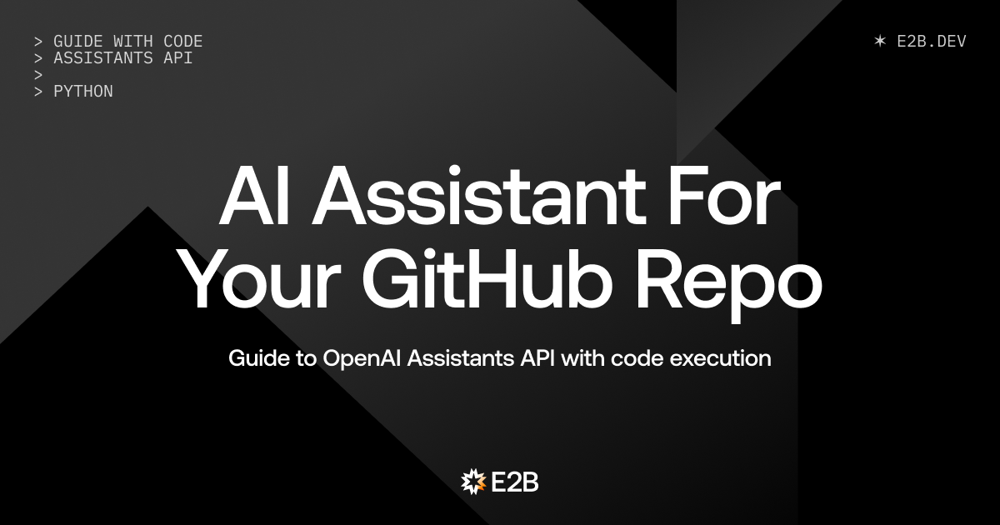

# Let OpenAI Assistants Work on Your GitHub Repo

## Python guide with complete code



We are E2B. We provide sandboxed cloud environments made for AI agents and AI apps. Try our Custom Sandboxes and support us on GitHub with a star if you like it. E2B sandboxes work with any LLM - we also support the new Assistants API.

---

> 🏁 **Final code:** [E2B Cookbook - OpenAI Assistant](link-to-code)

---

## What we will do

In this guide, we will build a custom AI agent that will clone our GitHub repository to its remote cloud environment, work on the repo there, and then commit the changes to GitHub. We will use the E2B Sandboxes for the remote execution of tasks, together with the Assistants API by OpenAI. The crucial concept from OpenAI we will use is Function Calling. You can find the final code [here](link-to-code). All links to particular parts of code in this post refer to the corresponding code on GitHub.

### Prerequisites

We are using two key concepts:
1. **OpenAI API** - Find your API key [here](api-key-link), read the intro to the Assistants API, and Function Calling.
2. **E2B Sandbox** - Find your (free) API key [here](sandbox-api-key-link), read the intro to the E2B Sandboxes.

Sign up via E2B docs to get your free API key for using sandboxes.

---


## 1. Create files

We create three files - `main.py`, `assistant.py` for defining the assistant's behavior, and `actions.py` for defining actions (Python functions) it can use.

---

## 2. Define actions for the assistant

In the `actions.py` file, we will define Python functions as runnable actions for the AI assistant and the LLM.

We first import the e2b Sandbox.

> Here we are using the default sandbox. For different use cases, we could use different custom sandboxes, for example, a code interpreter sandbox useful for advanced data analysis.

```python
import os
from typing import Any, Dict
from e2b import Sandbox
```

We then define actions (Python functions) that will be executed remotely in the sandbox. Each action corresponds to one OpenAI Function that the assistant is equipped with (see the next steps.)

We chose simple actions for reading files, writing content or code to files, listing files in a directory (in our case a GitHub repo), and committing and pushing changes to a repo.

For each action, we ensure that the action can be performed (see the # comments), and add a string indicating success or an error message.

```python
def save_code_to_file(sandbox: Sandbox, args: Dict[str, Any]) -> str:
    filename = args["filename"]
    code = args["code"]

    try:
        # Ensure directory structure exists
        dir = os.path.dirname(filename)

        sandbox.filesystem.make_dir(dir)

        # Write code to the specified file
        sandbox.filesystem.write(filename, code)

        return "success"
    except Exception as e:
        return f"Error: {e}"

def write_to_file(sandbox: Sandbox, args: Dict[str, Any]) -> str:
    filename = args["filename"]
    content = args["content"]

    try:
        # Ensure directory structure exists
        dir = os.path.dirname(filename)

        sandbox.filesystem.make_dir(dir)
        # Write content to the specified file
        sandbox.filesystem.write(filename, content)

        return "success"
    except Exception as e:
        return f"Error: {e}"

def list_files(sandbox: Sandbox, args: Dict[str, Any]) -> str:
    path = args["path"]

    try:
        # List files in the specified path
        files = sandbox.filesystem.list(path)
        # Format the list for response
        response = "\n".join(
            [f"dir: {file.name}" if file.is_dir else file.name for file in files]
        )
        return response
    except Exception as e:
        return f"Error: {e}"

def read_file(sandbox: Sandbox, args: Dict[str, Any]) -> str:
    path = args["path"]

    try:
        # Read the content of the specified file
        return sandbox.filesystem.read(path)
    except Exception as e:
        return f"Error: {e}"

def commit_and_push(sandbox: Sandbox, args: Dict[str, Any]) -> str:
    repo_directory = (
        "/home/user/repo"  # Assuming the repository is cloned to this directory
    )
    commit_message = args["commit_message"]
    
    # Perform Git operations (add, commit, push)
    git_add_proc = sandbox.process.start_and_wait(f"git -C {repo_directory} add .")
    if git_add_proc.stderr != "":
        return git_add_proc.stderr

    git_commit_proc = sandbox.process.start_and_wait(
        f"git -C {repo_directory} commit -m '{commit_message}'"
    )
    if git_commit_proc.stderr != "":
        return git_commit_proc.stderr

    git_push_proc = sandbox.process.start_and_wait(
        f"git -C {repo_directory} push -u origin"
    )  # Adjust 'main' to your branch name if different
    if git_push_proc.stderr != "":
        return git_push_proc.stderr

    return "success"
```

## 3. Define the assistant
Now we create the assistant itself inside the assistant.py. The specific feature of the OpenAI's Assistants API that we'll take advantage of is the Function calling.

> Function calling feature gives our AI assistant the ability to decide to call the sandbox actions we defined before.
> 
Here we also give instructions to the assistant and choose its parameters. Once we run this file, it prints the assistant's ID which we can save as an environment variable. 

> See the list of all your created assistants on the OpenAI platform webpage.

```python
from typing import List

from dotenv import load_dotenv
import openai
from openai.types.beta.assistant_create_params import Tool

load_dotenv()

def create_assistant():
    client = openai.Client()

    functions: List[Tool] = [
        {
            "type": "function",
            "function": {
                "name": "save_code_to_file",
                "description": "Save code to file",
                "parameters": {
                    "type": "object",
                    "properties": {
                        "code": {
                            "type": "string",
                            "description": "The code to save",
                        },
                        "filename": {
                            "type": "string",
                            "description": "The filename including the path and extension",
                        },
                    },
                },
            },
        },
        {
            "type": "function",
            "function": {
                "name": "write_to_file",
                "description": "Write text or other content to a file",
                "parameters": {
                    "type": "object",
                    "properties": {
                        "content": {
                            "type": "string",
                            "description": "The content to save",
                        },
                        "filename": {
                            "type": "string",
                            "description": "The filename including the path and extension",
                        },
                    },
                },
            },
        },
        {
            "type": "function",
            "function": {
                "name": "list_files",
                "description": "List files in a directory",
                "parameters": {
                    "type": "object",
                    "properties": {
                        "path": {
                            "type": "string",
                            "description": "The path to the directory",
                        },
                    },
                },
            },
        },
        {
            "type": "function",
            "function": {
                "name": "read_file",
                "description": "Read a file",
                "parameters": {
                    "type": "object",
                    "properties": {
                        "path": {
                            "type": "string",
                            "description": "The path to the file",
                        },
                    },
                },
            },
        },
        {
            "type": "function",
            "function": {
                "name": "commit_and_push",
                "description": "Commit and push changes to the repository",
                "parameters": {
                    "type": "object",
                    "properties": {
                        "commit_message": {
                            "type": "string",
                            "description": "The commit message",
                        },
                    },
                },
            },
        },
    ]

    ai_developer = client.beta.assistants.create(
        instructions="""You are an AI developer.
    The provided codebase is in the /home/user/repo.
    When given a coding task, you will work on it until it is completed. You will summarize your steps.
    If you encounter some problem, just communicate it please. 
    You can save code to file (or create a new file), list files in a given directory, read files, and commit and push changes.
    Please every time you are asked to do a task, do the task the best you can, and then commit and push it without asking.
    You are professional, don't argue, and just complete the task.
    """,
        name="AI Developer",
        tools=functions,
        model="gpt-4-1106-preview",
    )

    print("AI Developer Assistant created, copy its id to .env file:")
    print(ai_developer.id)

if __name__ == "__main__":
    create_assistant()
```

## 4. Create the main.py
Now we create the main program for running our assistant in the sandbox.

### Import packages
First, we import the necessary packages - openai, e2b Sandbox, and the actions we created in the other file.

```python
import os
from dotenv import load_dotenv
from e2b import Sandbox
import openai
import time
from actions import (
    read_file,
    save_code_to_file,
    list_files,
    commit_and_push,
    write_to_file,
)
```
### Retrieve assistant
We call the assistant using its ID. Then we use the OpenAI API to retrieve the assistant.

```python
load_dotenv()
client = openai.Client()

AI_ASSISTANT_ID = os.getenv("AI_ASSISTANT_ID")
assistant = client.beta.assistants.retrieve(AI_ASSISTANT_ID)
```
### Prompt user for GitHub repo and task
We define three functions that ask the user for
- GitHub repository URL
- Specifying the task for the AI agent (e.g., "Please write a code for printing first 100 number of a Fibonacci sequence into a "code.py" file)
- Providing the GitHub authentication token (use the classic Personal access token).


Then we set up the repo_directoryto be "/home/user/repo". This is the path in the sandbox where the repository will be cloned and where the assistant will work on the given task.

```python
def prompt_user_for_github_repo():
    repo_url = input("Please provide the URL of your public GitHub repository: ")
    return repo_url

def prompt_user_for_task(repo_url):
    user_task_specification = input(
        "Please provide what you want to achieve with that repository: "
    )
    user_task = (
        f"Please work with the codebase repository called {repo_url} "
        f"that is cloned in the /home/user/repo directory. Your task is: {user_task_specification}"
    )
    return user_task

def prompt_user_for_auth():
    user_auth = input("Please provide your github authentication token: ")
    return user_auth

# Determe the directory where we clone the repository in the sandbox
repo_directory = "/home/user/repo"
```
### Spawning the sandbox
Now we can define the mainfunction to spawn the E2B sandbox.


Inside the function, we choose the preferred sandbox. 

> E2B offers premade sandboxes or an option to build your own custom one with preferred packages, but here, it's enough to use the Default Sandbox and equip it with just the actions we have defined in the "actions.py". 

We use a sandbox.add_action() method to register the actions with the sandbox.
We start the sandbox and configure the AI assistant in git. We log the user to GitHub via the authentication token.
We assign the user's task to the assistant. Then we create a thread, send messages to the thread, and finally run the thread.

> Here, we are using the OpenAI's concept of threads, messages and runs.

```python
def main():
    sandbox = Sandbox(
        on_stderr=lambda message: print("[Sandbox stderr]", message),
        on_stdout=lambda message: print("[Sandbox stdout]", message),
    )
    sandbox.add_action(read_file).add_action(save_code_to_file).add_action(
        list_files
    ).add_action(commit_and_push).add_action(write_to_file)

    # Identify AI developer in git
    sandbox.process.start_and_wait(
        "git config --global user.email 'ai-developer@email.com'"
    )
    sandbox.process.start_and_wait("git config --global user.name 'AI Developer'")

    user_gh_token = prompt_user_for_auth()
    # Log in to github
    print("Logging you into your GitHub...")
    proc = sandbox.process.start_and_wait(
        f"echo {user_gh_token} | gh auth login --with-token"
    )
    if proc.exit_code != 0:
        print("Error: Unable to log into github")
        print(proc.stderr)
        print(proc.stdout)
        exit(1)
    # Check that user is logged into github
    proc = sandbox.process.start_and_wait("gh auth status")
    if proc.exit_code != 0:
        print("Error: Unable to log into github")
        print(proc.stderr)
        print(proc.stdout)
        exit(1)
    # Check that user is authenticated
    proc = sandbox.process.start_and_wait("gh auth setup-git")
    if proc.exit_code != 0:
        print("Error: Unable to se up Git auth with GitHub")
        print(proc.stderr)
        print(proc.stdout)
        exit(1)

    repo_url = prompt_user_for_github_repo()
    user_task = prompt_user_for_task(repo_url)

    git_clone_proc = sandbox.process.start_and_wait(
        f"git clone {repo_url} {repo_directory}"
    )
    if git_clone_proc.exit_code != 0:
        print("Error: Unable to clone the repository")
        exit(1)

    thread = client.beta.threads.create(
        messages=[
            {
                "role": "user",
                "content": f"Carefully plan this task and start working on it: {user_task} in the {repo_url} repository",
            },
        ],
    )

    run = client.beta.threads.runs.create(
        thread_id=thread.id, assistant_id=assistant.id
    )
```

Still  inside the main function, we print the assistant's process to the terminal. Each time it chooses to use one of the actions, we see in the terminal how it uses the action and whether it ends with success or error.


> Note: If the assistant is "queued", we are waiting for OpenAI's processes.

At the end, we close the sandbox.

```
while True:
        print("Assistant is currently in status:", run.status)
        if run.status == "requires_action":
            print("Assistant run:")
            print()
            print(f"ID: {run.id}")
            # print(f"Assistant ID: {run.assistant_id}")
            print(f"Status: {run.status}")
            # print(f"Instructions: {run.instructions}")
            # print(f"Metadata: {run.metadata}")
            # print(f"Model: {run.model}")
            print(f"Required Action: {run.required_action}")
            # print(f"Started At: {run.started_at}")
            # print("Assistant run", run)
            print()
            outputs = sandbox.openai.actions.run(run)
            print(outputs)
            print()
            if len(outputs) > 0:
                client.beta.threads.runs.submit_tool_outputs(
                    thread_id=thread.id, run_id=run.id, tool_outputs=outputs
                )

        elif run.status == "completed":
            print("Run completed")
            messages = (
                client.beta.threads.messages.list(thread_id=thread.id).data[0].content
            )
            text_messages = [message for message in messages if message.type == "text"]
            print("Thread finished:", text_messages[0].text.value)
            break

        elif run.status in ["queued", "in_progress"]:
            pass

        elif run.status in ["cancelled", "cancelling", "expired", "failed"]:
            break

        else:
            print(f"Unknown status: {run.status}")
            break

        run = client.beta.threads.runs.retrieve(thread_id=thread.id, run_id=run.id)
        time.sleep(0.2)

    sandbox.close()
```
Finally, under the main function, we write the code that is run if the script is the main program being executed.

```python
if __name__ == "__main__":
    main()
```

## Output

> 🏁 Final code: E2B Cookbook - OpenAI Assistant

Here are some examples of my assistant working on simple tasks - writing me a README, and creating a new file with a simple JavaScript code.


